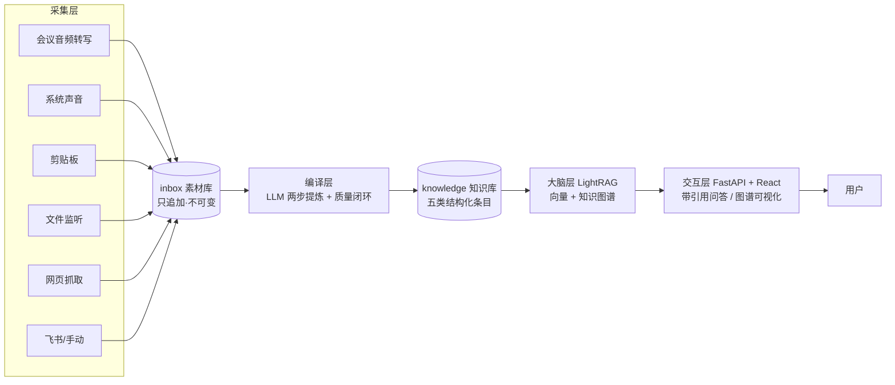
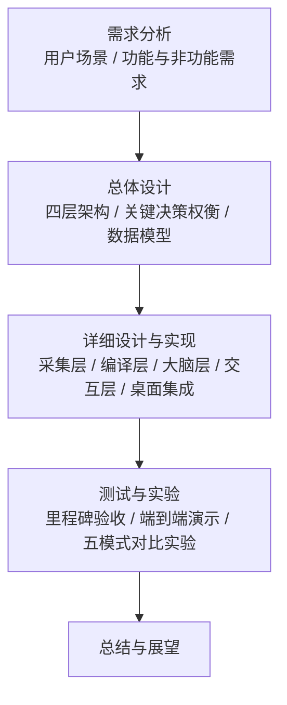

# 第 1 章 绪论

## 1.1 研究背景与意义

随着数字化办公的深入，知识工作者的信息输入日益多源化与碎片化：线上会议中形成的决策与结论、即时通讯工具里讨论的技术细节、浏览网页时获取的参考资料、日常文档与剪贴板中流转的片段信息，分散在彼此隔离的应用与文件中。这些信息往往转瞬即逝——一场会议结束后，其中的关键决策若无人工记录，数日内便难以回溯；而人工记录与整理本身成本高昂，且覆盖不全、格式随意，长期积累后又会面临"存了却查不到、查到却不系统"的困境。

个人知识管理（Personal Knowledge Management，PKM）工具在一定程度上缓解了"存"与"理"的问题。以 Notion、Obsidian、Logseq 为代表的笔记工具提供了良好的组织与链接能力，但它们本质上依赖用户的手动输入与整理：信息仍然要经过"人看到—人判断—人抄录"的链路，采集环节自动化程度低；其检索能力也以关键词匹配为主，难以回答"我们上次关于部署方案定了什么"这类需要跨文档综合的语义问题。

大语言模型（Large Language Model，LLM）的突破为上述困境提供了新的技术路径。以 Transformer 架构[1]为基础的大语言模型在自然语言理解与生成上表现出接近通用的能力[12]，使机器对非结构化文本的自动理解、结构化抽取与摘要成为可能。检索增强生成（Retrieval-Augmented Generation，RAG）[2][3]将外部知识库与 LLM 结合，让模型基于检索到的真实材料作答，显著缓解了幻觉问题并赋予模型私有知识；进一步地，将知识图谱引入检索过程的方法（如 GraphRAG[5]、LightRAG[4]）增强了模型对全局性、多跳性问题的处理能力[6]。这使得"自动采集原始信息—LLM 提炼为结构化知识—构建可问答的知识库"成为一条可工程化落地的完整链路。

与此同时，数据隐私构成了不容忽视的约束。会议录音、聊天内容、工作文档往往包含敏感信息，将其上传至第三方云服务进行转写与分析存在泄露风险。近年来端侧推理技术的进步——包括量化压缩模型、CPU 优化的推理引擎以及高质量的本地中文向量模型[8]——使得语音转写、语义检索等关键环节完全在本机完成成为现实选择，"数据不出本机"从理想变为可行的工程方案。

基于以上背景，本课题设计并实现了 KnowSeq Agent——一个本地轻量运行的个人知识采集与知识图谱问答系统。系统自动无感地采集多源信息（会议音频转写、系统声音、剪贴板、文件监听、网页抓取、飞书与手动导入），由云端大语言模型将原始素材提炼为结构化知识条目，再经 LightRAG 构建"向量检索 + 知识图谱"双通道知识大脑，提供带引用溯源的智能问答与图谱可视化，并通过 Windows 托盘、右键菜单与桌面壳实现低打扰的桌面集成。本课题的意义在于：（1）将"采集—编译—存储—问答"四个环节打通为端到端的自动化流水线，为个人级知识管理系统的工程化实现提供了完整参考；（2）探索了云端 LLM 与本地推理（本地 ASR、本地向量化）混合部署的平衡点，在能力与隐私之间取得兼顾；（3）基于 LightRAG 的增量幂等索引与五类知识条目模型，给出了小型知识图谱问答系统的可复用设计模式。

**图 1-1 KnowSeq Agent 系统总体概览**（Mermaid 初稿，终稿排版时重绘）：

## 1.2 国内外研究现状

### 1.2.1 个人知识管理工具的演进与局限

个人知识管理工具经历了从文档库到双向链接笔记的演进。Notion 以块编辑与数据库视图见长，Obsidian 与 Logseq 以本地 Markdown 文件和双向链接为核心，支持知识网络的自由生长。这类工具解决了知识的"组织"与"关联"问题，但存在三点共性局限：其一，采集依赖人工，无法自动捕获会议、剪贴板、系统声音等原生信息流；其二，知识加工停留在人工书写层面，缺乏自动提炼、去重与关联推荐；其三，检索以关键词和链接遍历为主，缺少基于语义的理解式问答。近年来出现了以 Rewind、screenpipe 为代表的"记录一切"式屏幕记忆工具，将屏幕内容与音频持续采集为可检索的素材，但在"从素材到结构化知识"的提炼环节仍着力于原始回放与全文检索，知识密度提升有限。总体来看，"自动采集 + 自动提炼 + 语义问答"三者的闭环在个人级工具中尚未被完整实现，这正是本课题的切入点。

### 1.2.2 大语言模型与检索增强生成

2017 年 Vaswani 等人提出 Transformer 架构[1]，其自注意力机制成为后续大语言模型的统一基础。经过大规模预训练与指令微调，大语言模型展现出强大的语言理解、知识问答与内容生成能力，自然语言处理进入"大模型时代"[12]。然而，大模型的参数化知识存在时效滞后与私有领域缺失的问题，且容易生成貌似合理却不真实的内容（幻觉）。检索增强生成[2]通过"先检索、后生成"的范式将外部知识注入生成过程，成为大模型落地私有知识场景的主流方案。Gao 等人对 RAG 的系统综述[3]将其归纳为"索引—检索—生成"三阶段，并指出朴素 RAG 在多跳推理与全局性问题上能力不足。这些研究为本课题中"以 LLM 提炼知识、以 RAG 支撑问答"的技术路线提供了直接依据。

### 1.2.3 大模型与知识图谱的融合

知识图谱以实体—关系—实体的三元组形式组织结构化知识，其构建技术（实体抽取、关系抽取、知识融合）已有成熟综述[11][15]。大模型与知识图谱的融合是当前的研究热点：Pan 等人[6]系统梳理了 KG 增强 LLM 与 LLM 增强 KG 的双向路线，其中"利用 LLM 从非结构化文本中自动构建知识图谱"正是本课题大脑层的核心技术。在问答侧，微软提出的 GraphRAG[5]利用 LLM 抽取实体关系构建图索引，并按社区层级生成摘要以回答全局性问题，但社区摘要的构建成本高昂且难以增量更新。香港大学提出的 LightRAG[4]以更低成本实现图增强检索：它将图检索划分为实体/关系级的低层检索与主题级的高层检索，支持增量插入且无需重建全局摘要，兼顾了回答质量与更新效率。本课题选择 LightRAG 作为知识引擎，正是取其"图检索增强 + 低成本增量索引"的优势。

### 1.2.4 语音识别及其本地化

语音识别是会议信息采集的前提。OpenAI 的 Whisper[7]通过 68 万小时弱监督数据训练，在多语言场景下取得了优异的识别效果，但其较大参数量在个人设备上运行成本高。模型量化技术为端侧部署提供了途径，其中 BitNet 采用三值权重（-1/0/1）大幅压缩模型体积与计算量，使大模型在 CPU 上推理成为可能。在评测基准方面，AISHELL-4[13]与 AliMeeting[14]是中文会议场景的两个代表性公开数据集，为转写质量提供了可比的评价口径（错误率指标，中文场景通常按字错误率计算）。在向量检索侧，C-Pack[8]提供的 BGE 系列中文向量模型支持完全本地的语义检索。上述进展共同表明：在普通个人电脑的 CPU 上完成"会议音频—文字—向量—图谱"的全本地化处理链路，在当前技术条件下是可行的。

## 1.3 论文主要工作

本课题围绕"个人知识自动沉淀与图谱问答"这一目标，设计并完整实现了 KnowSeq Agent 系统，主要工作如下：

（1）**多源采集层的设计与实现。** 实现了会议音频转写（VibeVoice-ASR-BitNet 本地 CPU 转写，子进程调用）、系统声音直采（WASAPI loopback 分段采集）、剪贴板监控、文件监听、网页正文抓取、飞书导入与手动导入共七种入库通道，统一汇聚到只追加、不可变的 inbox 素材库，以 compiled 标记实现编译幂等。

（2）**知识编译层的移植与适配。** 将开源项目 nashsu/llm_wiki 的 ingest 内核移植为 Python 实现（移植边界与 GPL-3.0 合规性在文中如实标注），形成"素材分析—知识生成—质量审查"的九步编译流水线，包含两步思维链提炼、持久化任务队列（429 限流自动暂停与恢复）、SHA256 双条件编译缓存、上下文预算控制以及 lint/dedup/enrich/review 质量闭环，产出决策、教训、概念、关联、疑问五类结构化知识条目。

（3）**基于 LightRAG 的知识大脑层。** 封装 LightRAG 引擎（lightrag-hku 1.5.7）为同步门面 BrainEngine，实现知识条目的增量幂等索引（相对路径文档 ID + 内容哈希）、本地中文向量模型（bge-small-zh-v1.5）与本地存储（JsonKV/NanoVectorDB/NetworkX）的轻量部署，提供语义检索、带引用问答与图谱导出能力。

（4）**交互层与桌面集成。** 基于 FastAPI 与 React 19 实现七页控制台（问答、图谱、知识库、编译、素材、采集、设置），图谱页以 sigma.js v3 结合 ForceAtlas2 布局与 Louvain 社区着色实现大规模图渲染；通过 pystray 托盘、HKCU 注册表右键菜单、开机自启与 Tauri 2.x 桌面壳（WebView 直连本地服务 + 单实例 + 悬浮控件）完成低打扰的 Windows 桌面集成。

（5）**系统测试与对比实验。** 按五个里程碑完成功能验收（编译链路 31/31、大脑链路 19/19），完成端到端演示验证，并设计了 LightRAG 五种检索模式（naive/local/global/hybrid/mix）的对比实验，从引用命中率、响应时延等维度分析各模式的适用场景。

**图 1-2 论文技术路线**（Mermaid 初稿，终稿排版时重绘）：

## 1.4 论文组织结构

本文共分七章。第 1 章介绍研究背景与意义、国内外研究现状及主要工作；第 2 章介绍系统涉及的相关理论与技术；第 3 章给出系统需求分析，包括功能需求、非功能需求与范围边界；第 4 章阐述系统总体设计，重点分析关键设计决策的权衡过程；第 5 章按层次详细描述系统各模块的设计与实现；第 6 章给出系统测试、量化指标分析与检索模式对比实验；第 7 章总结全文并展望后续工作。
