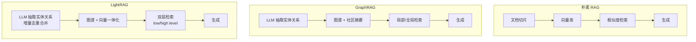
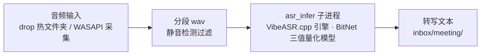

# 第 2 章 相关理论与技术

本章介绍系统涉及的关键理论与技术，包括大语言模型、检索增强生成与图增强检索、知识图谱与图可视化、本地语音识别、Windows 音频回环采集，以及 Web 服务与前端可视化技术，为后续章节的设计与实现奠定基础。

## 2.1 大语言模型

大语言模型是基于 Transformer 架构[1]、在海量文本上通过自监督预训练获得的通用语言模型。Transformer 抛弃了循环结构，完全依靠自注意力机制建模序列中任意位置之间的依赖关系，具备良好的并行性与长程依赖捕捉能力；其"预训练—微调—对齐"的训练范式使模型从单纯的文本补全器演变为能够遵循指令的通用助手。在大模型时代[12]，模型能力沿"规模—数据—对齐"三条主线持续增强，并涌现出上下文学习、思维链推理（Chain-of-Thought，CoT）等能力：前者使模型能够根据提示中的示例举一反三，后者通过引导模型分步推理显著提升复杂任务表现。

在工程应用层面，大语言模型的接入方式主要有两类：云端 API 调用与本地推理。云端 API 具有模型能力强、免运维的优点，适合质量敏感的生成任务；本地推理则通过量化压缩将模型参数从 16 位浮点降至 8 位、4 位乃至三值，在牺牲少量精度的情况下大幅降低显存与算力需求，适合隐私敏感或离线场景。本系统采取混合策略：知识编译、问答生成与实体抽取等语言生成任务调用云端 LLM（OpenAI 兼容协议），而向量化与语音转写均在本机完成，兼顾质量与隐私。

提示工程（Prompt Engineering）是稳定获取结构化输出的关键手段。本系统在编译层大量使用了结构化输出契约：通过在提示中明确规定输出格式（如以文件块标记包裹的 Markdown 条目、JSON 对象）、要求语言与字段约束，并对模型输出进行解析校验与失败重试，保证 LLM 的产出可以被下游程序可靠消费。

## 2.2 检索增强生成与图增强检索

### 2.2.1 朴素 RAG 与混合检索

检索增强生成[2]将生成过程与外部知识库解耦：先由检索器根据用户问题从知识库中召回相关片段，再由生成器基于问题与召回片段生成回答。Gao 等人[3]将朴素 RAG 的工作流归纳为索引、检索、生成三个阶段，并系统分析了其三类瓶颈：检索质量（语义鸿沟、召回不全）、索引质量（切片粒度、信息噪声）与生成质量（幻觉、引用缺失）。为提升召回质量，实践中发展出混合检索（Hybrid Retrieval）策略，即同时利用向量语义检索（捕获近义与跨表述）、关键词检索（捕获精确术语）与结构化检索（利用元数据过滤），并对多路结果做融合排序。向量检索本身依赖嵌入模型将文本映射为稠密向量，中文场景以 C-Pack[8]发布的 BGE 系列模型应用最广，其中 bge-small-zh-v1.5 体积小、可完全本地运行，是个人级系统的合理选择。

### 2.2.2 从 GraphRAG 到 LightRAG

朴素 RAG 以"文本片段"为检索单元，难以回答需要跨文档综合的全局性问题（如"这个项目的主要决策脉络是什么"）。GraphRAG[5]提出图增强的解决路径：利用 LLM 从语料中抽取实体与关系构建知识图谱，按社区（community）层级预生成摘要，回答时按问题层次选择局部或全局检索。该方法显著提升了全局性问题的回答质量，但社区摘要的生成成本高、语料更新时需要重新划分社区，增量维护代价大。

LightRAG[4]以更轻量的方式实现图增强检索，是本系统大脑层的核心引擎。其关键设计包括：（1）双层检索——将查询分为低层（low-level）与高层（high-level）两类，低层检索面向具体实体与关系（如"某接口的参数含义"），高层检索面向主题与概念（如"项目沟通机制"），检索过程中图谱信息与原始文本块向量信息融合召回，兼顾结构化知识与原文细节；（2）增量索引——文档插入时仅抽取新实体与新关系并做去重合并，无需全图重建，天然支持知识库的持续增长；（3）图与向量一体化存储——实体/关系表与文本块向量共同构成检索基础，检索时图结构提供"关联扩展"能力，弥补向量检索对多跳关联的盲区。LightRAG 提供了多种检索模式以适配不同问题类型，本系统在第 6 章对 naive、local、global、hybrid、mix 五种模式进行了系统的对比实验。

**图 2-1 朴素 RAG、GraphRAG 与 LightRAG 的对比**（Mermaid 初稿，终稿排版时重绘）：

### 2.2.3 大模型与知识图谱的协同

从更宏观的视角看，大模型与知识图谱的融合是双向的[6]：一方面，知识图谱可以为大模型提供结构化、可追溯的知识注入与推理约束；另一方面，大模型极大降低了知识图谱的构建门槛——传统实体关系抽取依赖人工标注的专用模型，而大模型经提示即可完成开放域抽取。本系统属于"LLM 增强 KG"路线：编译层产出的知识条目与条目间的关联链接构成人工可审阅的知识层，大脑层再由 LLM 从条目中自动抽取实体关系形成图谱检索层，两层共同支撑问答。

## 2.3 知识图谱与图可视化

知识图谱以三元组（头实体，关系，尾实体）为单位组织知识，其表示、构建与应用已有系统综述[11][15]。在本系统中，图谱由 LightRAG 在文档索引过程中自动构建：节点为实体（携带类型与描述），边为关系（携带描述与权重），知识条目原文作为文本块与图谱节点关联，从而实现"图谱导航—原文回溯"的闭环。

图可视化的核心挑战是大规模图的布局与渲染。力导向布局（Force-Atlas2 等）通过模拟节点间的斥力与边上的引力迭代求解节点坐标[10]，使连接紧密的节点自然聚集、社区结构直观可辨；Louvain 算法[9]基于模块度优化进行社区发现，复杂度近似线性，适合为节点按社区着色以增强图的可读性。渲染层面，sigma.js v3 基于 WebGL 实现数十万节点级的流畅渲染，graphology 提供图数据结构与社区发现、布局等算法实现，二者是当前 JavaScript 图可视化的主流组合。本系统图谱页采用 graphology 建模 + Louvain 社区着色 + ForceAtlas2 布局（Web Worker 中计算以避免阻塞界面）+ sigma.js v3 渲染的完整技术链。

## 2.4 本地语音识别

自动语音识别（Automatic Speech Recognition，ASR）的任务是将音频信号转换为文字，典型流水线包括：音频前端（分帧、特征提取）、声学模型（语音到音素/子词的后验概率）、语言模型与解码器（搜索最优文本序列）。现代端到端模型（如 Whisper[7]）以编码器—解码器结构直接建模"音频—文本"，通过大规模弱监督数据获得跨语言、跨场景的鲁棒性。识别质量以错误率评价，中文场景通常报告字错误率（Character Error Rate，CER）口径的指标；评测集方面，AISHELL-4[13]与 AliMeeting[14]分别提供了真实会议场景的中文多说话人语料与基准，是会议转写质量的代表性标尺。

端侧部署的关键在于模型压缩与推理引擎。BitNet 类三值量化将权重约束在 {-1, 0, 1}，模型体积与矩阵乘法开销大幅下降，配合 CPU 优化的推理引擎（本项目采用 llama.cpp 系的 C++ 引擎以子进程方式调用），可在普通多核 CPU 上获得接近实时的转写速度（实时率 RTF < 1）。本系统采用微软开源的 VibeVoice-ASR 模型配合 BitNet 三值量化版本，在 1.5B 参数量级实现中文会议转写，模型体积约 1.58 GB，实测 CPU 实时率约 0.71，在 AISHELL-4 与 AliMeeting 两个公开测试集上的错误率分别为 27.45 与 40.58（详见第 6 章）。

**图 2-2 本地会议转写流水线**（Mermaid 初稿，终稿排版时重绘）：

## 2.5 Windows 音频回环采集（WASAPI loopback）

会议系统声音（对方发言、系统提示音等）的捕获是桌面端会议采集的难点。Windows 音频会话 API（Windows Audio Session API，WASAPI）提供了 loopback（回环）模式：在共享音频模式下，应用程序可以打开渲染端点（扬声器）的回环捕获流，直接读取系统混音后送入输出设备的音频数据，无需虚拟声卡或驱动级钩子。相比"虚拟声卡中转"方案，loopback 直采无需安装额外软件、系统资源开销低，代价是仅在共享模式下可用且设备切换时需要重建流。本系统基于 pyaudiowpatch（WASAPI 的 Python 封装）实现系统声音源：定时探测默认输出设备、按固定时长（默认 300 秒）将混音流分段落盘为 wav 文件，静音段经能量峰值检测直接跳过，段文件随后进入与会议音频一致的本地转写链路。

## 2.6 Web 服务与前端技术

**FastAPI** 是基于 Python 类型注解与 ASGI 标准的现代 Web 框架，支持异步请求处理、自动 OpenAPI 文档与基于 Pydantic 的请求校验。本系统后端以 FastAPI 提供全部 REST API，并通过本机 Host/Origin 双校验中间件防止非本机来源的跨站请求。

**React 与构建工具链**：React 是当前主流的声明式前端框架，本系统采用 React 19 + TypeScript + Vite 的组合——TypeScript 提供静态类型约束，Vite 提供秒级冷启动的开发体验与基于 Rollup 的生产构建。前端七个页面通过 react-router 组织为单页应用，构建产物（dist）直接由 FastAPI 托管，形成"一个端口、一个进程"的简洁部署形态。

**图可视化栈**：sigma.js v3（WebGL 渲染）+ graphology（图数据结构与算法）+ ForceAtlas2（力导向布局）+ Louvain（社区发现），其原理已在 2.3 节说明。

## 2.7 Tauri 桌面应用框架

Tauri 2.x 是基于 Rust 的桌面应用打包框架，与 Electron 相比不捆绑浏览器内核，而是复用操作系统自带的 WebView2，安装包体积与内存占用显著更小。Tauri 的 sidecar 机制允许将外部可执行文件随应用打包，并在应用生命周期内作为子进程管理，适合"Rust 壳 + 既有本地服务"的架构。本系统桌面壳采用方案 A：Tauri 壳仅负责窗口管理（启动探测、关窗隐藏、单实例、托盘与悬浮控件），通过 WebView 直接加载本机 FastAPI 服务（http://127.0.0.1:8765），后端代码零改动；PyInstaller 打包的后端可作为 sidecar 随壳分发，相关口子在实现层已预留。

## 2.8 本章小结

本章梳理了系统的技术基础：大语言模型与思维链为知识提炼提供生成能力；RAG 及其图增强演进（GraphRAG、LightRAG）支撑带引用、可追溯的问答；BGE 中文向量模型与本地 ASR（量化 + CPU 推理）使关键环节可完全本地化；WASAPI loopback 解决系统声音采集；FastAPI/React/sigma.js 构成交互层骨架；Tauri 以低开销完成桌面化。后续章节将依次给出这些技术在具体系统中的需求、设计与实现。

---

**表 2-1 系统相关技术选型一览**

| 类别 | 技术/组件 | 版本 | 用途与选型理由 |
|---|---|---|---|
| 语言生成 | DeepSeek-V4-Flash（火山方舟，OpenAI 兼容协议） | — | 编译提炼/问答生成/实体抽取，云端质量优先 |
| 知识引擎 | lightrag-hku | 1.5.7 | 图 + 向量一体化检索，支持增量索引 |
| 向量模型 | bge-small-zh-v1.5（本地） | 512 维 | 中文语义向量，本地运行保隐私 |
| 语音识别 | VibeVoice-ASR + BitNet 量化 + VibeASR.cpp | 1.5B 解码器 | CPU 实时转写，数据不出本机 |
| 音频采集 | pyaudiowpatch | — | WASAPI loopback 系统声音直采 |
| 后端框架 | FastAPI + Uvicorn | — | 异步 API、类型校验、静态托管 |
| 前端框架 | React 19 + TypeScript + Vite | Vite 6 | 声明式 UI、类型安全、快速构建 |
| 图可视化 | sigma.js v3 + graphology + ForceAtlas2 + Louvain | — | 大规模图谱渲染与社区着色 |
| 桌面壳 | Tauri 2.x | — | 复用系统 WebView，sidecar 分发口子 |
| 本地存储 | JsonKV + NanoVectorDB + NetworkX | — | KV/向量/图三类数据零依赖落盘 |
