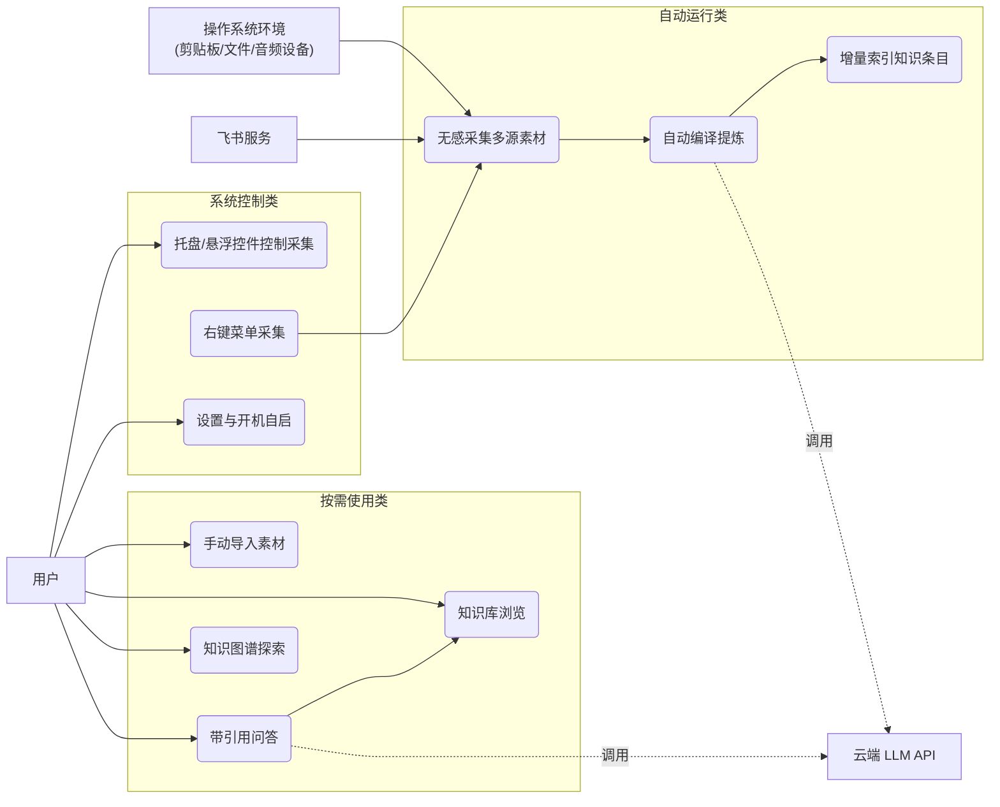
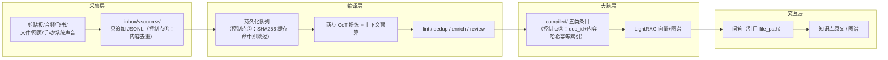

# 第 3 章 系统需求分析

需求分析是系统设计与实现的前提。本章从系统总体目标与用户场景出发，采用里程碑需求文档（docs/m1-requirements.md ~ m5-requirements.md，REQ-101~509）与产品需求文档（docs/prd.md，FR-001~052、NFR-001~006）作为素材来源，对 KnowSeq Agent 的功能需求按模块归纳，对非功能需求按质量属性分组，并通过用例分析与数据流刻画核心需求的完整闭环，最后对系统范围边界进行论证。

## 3.1 系统总体目标与用户场景

### 3.1.1 总体目标

知识工作的主要瓶颈早已不是信息稀缺，而是信息过载下的沉淀低效：会议录音散落在聊天工具、剪贴板内容转瞬即逝、网页资料看完即忘，这些碎片化信息难以转化为可检索、可复用的个人知识。通用笔记工具要求用户手动整理，云端 PKM 服务又存在隐私顾虑。针对上述矛盾，本系统的总体目标定义为：

在单用户的本地 Windows 环境中，构建一个"自动无感采集 → 大模型提炼沉淀 → 图谱化检索问答"的个人知识管理 Agent。系统以 Windows 后台服务形态常驻，在用户无感知的情况下持续捕获多来源素材，经由云端大语言模型按预算提炼为结构化知识条目，再通过 LightRAG 构建可增量更新的向量—图谱混合索引，最终以带引用的问答和可交互的知识图谱完成知识的消费闭环。除大模型与嵌入向量调用外，所有素材、条目与索引数据均落盘本机，保障数据主权与隐私。

### 3.1.2 用户场景

系统的目标用户为单人的知识工作者（如研究生、研究员、开发者），典型工作日场景如下：

（1）上午参加线上会议，系统声音源以 WASAPI loopback 直接捕获扬声器音频，本地 CPU 完成转写并落盘；会议中复制的一段关键技术描述，被剪贴板监听即时捕获。

（2）午后浏览技术网页，通过右键菜单或控制台粘贴 URL，系统抓取正文入库；一份本地 Markdown 报告拖入监听目录后自动采集。

（3）后台编译队列在新素材达到触发条件后自动运行：大模型将素材提炼为决策、经验、概念、关联、问题五类知识条目，写入本地知识库；大脑层随后完成增量索引。

（4）傍晚撰写综述时向问答页提问，系统返回带引用的回答，点击引用直接跳转到知识条目原文；在图谱页观察新知识与既有知识形成的关联，完成一次"采集—沉淀—消费"的完整闭环。

该场景隐含了三条核心需求线索：采集必须"无感"（不增加用户负担）、提炼必须"可控"（有预算、有缓存、可恢复）、消费必须"可溯源"（回答能回链到原始素材与知识条目）。

## 3.2 功能需求分析

系统功能需求按工程基础、多源采集、知识编译、知识大脑、交互层、Windows 集成六个模块归纳，表 3-1 给出汇总，各小节展开说明。

### 3.2.1 工程基础与素材模型（REQ-101~102）

工程基础需求（REQ-101）要求以 FastAPI/uvicorn 提供单一本地服务（端口 8765），配置采用双轨制：非敏感项（目录、开关、监听目录、来源启用项）置于 config.yaml，敏感项（飞书凭据、LLM API Key）置于 .env 且不进入版本库。素材模型需求（REQ-102，对应设计决策 ADR-013）规定 inbox 为只追加的不可变存储：每条素材为一条 JSONL 记录，携来源（source）、捕获时间等元数据，写入后不修改；提炼结果以"顶格标记"方式记录完成状态，保证同一素材重复处理幂等，并为重跑流水线提供基础。

### 3.2.2 多源采集（REQ-103~109、REQ-501）

采集管理器（REQ-103）统一调度各来源的启停与去重（对素材内容哈希判重）。六类自动源需求为：

（1）剪贴板监控（REQ-105）：Windows 剪贴板轮询，周期可配，仅采集文本，超长截断（上限可配，默认 50k 字符），落盘为 source=clipboard 素材。

（2）会议音频转写（REQ-104，ADR-014）：音频文件经热文件夹或手动导入触发，调用本地 VibeASR.cpp 引擎（VibeVoice-ASR-BitNet 模型）以子进程方式完成 CPU 转写，不依赖云端语音服务。

（3）飞书接入（REQ-106）：lark-oapi 机器人以 WebSocket 长连接接收群聊/单聊消息，云文档经导出导入接口入库，元数据记录会话标识与发送者。

（4）文件监听（REQ-107）：watchdog 监听配置目录中新增/修改的文档（md/txt 等），读取文本后落盘并记录原路径。

（5）网页抓取（REQ-108）：对给定 URL 以 requests 抓取、readability-lxml 抽取正文，元数据记录 URL。

（6）手动导入（REQ-109）：控制台或前端粘贴文本、上传文件，覆盖无法自动捕获的场景。

此外，M5 里程碑新增系统声音捕获源（REQ-501）：基于 WASAPI loopback 直接捕获系统播放的音频，默认 300 秒分段、静音峰值检测辅助切分、默认不混入麦克风（include_mic=false），与会议音频源共用本地转写引擎。

### 3.2.3 知识编译（REQ-201~214）

编译层负责把非结构化素材转化为结构化知识条目，需求覆盖完整流水线（REQ-201~214）：LLM 客户端（REQ-202，SSE 流式解析）；文本处理与长源语义分块（REQ-203/208，处理逻辑移植自开源项目 llm_wiki）；上下文预算（REQ-204，按字符配额为系统提示、少样本示例与素材内容分配空间）；幂等与缓存（REQ-205，以素材内容 SHA256 双条件判断命中）；持久化编译队列与落盘协调（REQ-206，进程重启不丢进度）；两步思维链提炼编排（REQ-207）；结构化 lint（REQ-209）、轻量 review 闭环（REQ-210）、LLM 批量去重（REQ-211）与 wikilinks 富化（REQ-212）构成质量保障环节；控制台集成（REQ-213）与端到端验收（REQ-214，验收 31/31 通过）收尾。

### 3.2.4 知识大脑（REQ-301~306）

大脑层需求以 LightRAG 为知识引擎封装（REQ-301），提供四项核心能力：知识库索引（REQ-302，按条目文件与内容哈希增量索引，避免全量重建）；语义检索（REQ-303）；带引用问答（REQ-304，回答须附来源文件路径）；图谱导出（REQ-305，供前端可视化）。大脑 API 与控制台面板（REQ-306）将上述能力经 REST 接口暴露给前端。

### 3.2.5 交互层（REQ-401~411）

交互层需求包括前端工程骨架与静态托管（REQ-401，React 19 + Vite + TypeScript，构建产物由后端托管）、统一设计系统（REQ-402）与七页信息架构（REQ-403~410）：问答页（REQ-405，对应 FR-030，回答带引用并可跳转知识库原文）、图谱页（REQ-407，对应 FR-031，力导向布局与社区着色）、知识库浏览页（REQ-406，条目原文与反向链接）、编译页（REQ-404，队列与流水线状态）、素材管理与采集控制页（REQ-408，对应 FR-040）、知识管理页（REQ-409，对应 FR-041）与设置页（REQ-410，对应 FR-042）。全局布局与状态总览（REQ-403）聚合各模块运行状态。里程碑级端到端验收（REQ-411）要求新前端全页面贯通后下线旧控制台前端。

### 3.2.6 Windows 集成与桌面壳（REQ-110~111、REQ-502~507）

系统集成需求使服务融入 Windows 使用习惯：M1 阶段的极简控制台（REQ-110，ADR-012）与托盘雏形（REQ-111）提供手动导入与采集总开关；M5 阶段引入 Tauri 2.x 桌面壳骨架（REQ-502），以 WebView 加载本地服务页面、以后端为 sidecar 子进程随壳启停；桌面体验需求（REQ-503）要求关窗即隐藏到托盘且防止多实例；悬浮开始/结束控件（REQ-504）服务会议场景的快速录音控制；sidecar 演进口子（REQ-505）保证演示环境下前后端可靠握手；注册表右键菜单（REQ-506）在任意目录提供"采集到此/停止采集"入口；开机自启（REQ-507）基于 HKCU Run 键实现，无需管理员权限。

**表 3-1 功能需求汇总表**

| 模块 | 需求编号（溯源） | 要点 |
|---|---|---|
| 工程基础与素材模型 | REQ-101~102 | FastAPI 单服务（8765 端口）；config.yaml/.env 双轨配置；inbox 只追加 JSONL（ADR-013）、顶格标记幂等 |
| 多源采集 | REQ-103~109、REQ-501 | 统一调度与去重；剪贴板、音频转写、飞书、文件监听、网页、手动六源；WASAPI loopback 系统声音 |
| 知识编译 | REQ-201~214 | SSE 客户端、移植文本处理与分块、上下文预算、SHA256 缓存、持久化队列、两步 CoT、lint/review/dedup/enrich |
| 知识大脑 | REQ-301~306 | LightRAG 封装；增量索引；语义检索；带引用问答；图谱导出；REST API |
| 交互层 | REQ-401~411 | React 七页（问答/图谱/知识库/编译/素材/采集/设置）；引用跳转闭环；设计系统；端到端验收 |
| Windows 集成与桌面壳 | REQ-110~111、REQ-502~507 | 控制台与托盘；Tauri 壳与 sidecar；关窗隐藏、防多实例；悬浮控件；右键菜单；开机自启 |
| 演示与验收 | REQ-214、REQ-411、REQ-508~509 | 演示数据与脚本；三个里程碑端到端验收记录 |

## 3.3 非功能需求

产品需求文档（docs/prd.md）以 NFR-001~006 定义了系统的质量属性，编译层需求（docs/m2-requirements.md NFR-201~204）予以细化，结合实现阶段沉淀的已证事实，归纳为六组：

（1）本地优先与隐私（NFR-001/002）：除 LLM 与 embedding API 调用外，所有数据存储与处理在本机完成；API Key 仅本地配置，不外传、不写入任何日志与控制台输出（NFR-201）。嵌入式向量模型（bge-small-zh-v1.5）亦本地运行，问答环节的文本出网范围被压缩至"提炼与问答两处 LLM 调用"。

（2）轻量与常驻（NFR-003）：依赖从简、避免重型运行时，服务可后台常驻；转写采用本地 CPU 引擎而非 GPU 集群，符合个人设备资源约束。

（3）增量与幂等（NFR-004）：编译与索引只处理新增内容，不重复全量。落地为三处机制：编译 SHA256 双条件缓存、inbox 顶格标记、大脑索引按条目文档 ID 与内容哈希判重。

（4）可恢复（NFR-006）：素材只追加不修改，提炼流水线可整体重跑；编译队列、检查点与缓存持久化（NFR-203），进程重启不丢进度；落盘串行 FIFO 并以 try/finally 保证锁释放（NFR-204）。

（5）可审计（NFR-005）：回答与知识条目可溯源到原始素材——条目元数据记录来源素材路径，问答引用记录条目文件路径，形成"素材→条目→回答"的两级回链。

（6）安全与可观测：本地服务绑定 127.0.0.1 并校验 Host/Origin 头，知识库读取接口做路径规范化以防目录穿越；关键链路（采集、编译、索引、问答）输出结构化日志，索引状态可查询，支撑缺陷定位（第 5 章将给出依据该可观测性定位并修复索引卡死缺陷的案例）。

性能方面不设硬性数值指标，但给出定性预算：采集链路不得阻塞用户前台操作；转写延迟以本地 CPU 可接受的实时率水平为限（第 6 章实测 RTF≈0.71）；索引与编译在增量模型下随知识库规模线性增长而非全量重算。

## 3.4 用例分析与数据流

### 3.4.1 总体用例

系统为单用户系统，参与者包括：用户（唯一人类角色）、操作系统环境（剪贴板、文件系统、音频设备等事件源）、飞书服务（外部消息源）与云端 LLM API（提炼/问答与嵌入调用）。图 3-1 给出总体用例，按"自动运行、按需触发、系统控制"三组组织。

图 3-1 系统总体用例图（终稿排版时重绘）

### 3.4.2 素材全生命周期数据流

一条素材从被捕获到支撑问答，依次经过采集、编译、大脑、交互四个层级的处理。图 3-2 给出全生命周期数据流，并标注三处幂等/可恢复控制点。

图 3-2 素材全生命周期数据流（终稿排版时重绘）

以一条剪贴板素材为例：监听线程捕获文本并判重后，以 source=clipboard 追加写入 inbox；编译队列在触发条件满足后取出素材，先经 SHA256 缓存判断（命中则直接跳过，未命中则调用大模型两步提炼），提炼结果经 lint、去重、富化后写为知识条目文件，并在 inbox 素材记录顶格标记完成状态；大脑层扫描条目文件，按"文档 ID + 内容哈希"判断增量，仅对新条目执行 LightRAG 索引；用户随后在问答页提问，系统检索图谱与向量双层上下文生成带引用回答，引用的 file_path 支持一键跳转知识库原文。三个控制点分别保证了采集不重复、编译可跳过、索引可幂等，共同支撑了 NFR-004/006 的增量与可恢复需求。

## 3.5 范围边界论证

基于单用户本地化的产品定位，系统明确不纳入以下范围：

（1）多用户与账号体系：inbox/compiled 为本地目录模型，条目与索引均无归属主体概念，引入多用户需重构存储与权限模型，且与"个人知识管理"定位不符。

（2）云同步：云同步与 NFR-001 本地优先存在张力，且素材只追加模型下的多端冲突合并会显著增加复杂度；当前以"数据在本机、模型在云端"的折中满足隐私与能力双重要求。

（3）移动端：系统的核心采集能力（剪贴板监听、WASAPI loopback、注册表右键菜单、托盘）深度依赖 Windows 系统 API，移动平台无法复用，强行移植将退化为功能残缺的手动导入工具。

（4）实时协作：协同编辑需要 CRDT/OT 与权限体系支撑，而系统的知识消费以"个人检索问答"为主形态，协作需求的投入产出比低，故不纳入。

## 3.6 本章小结

本章从单用户本地知识管理 Agent 的定位出发，梳理了系统的功能需求（六个模块，对应 REQ-101~509 与 FR-001~052）与非功能需求（六组质量属性），通过总体用例图与素材全生命周期数据流刻画了"采集—编译—索引—问答"的闭环结构，并论证了多用户、云同步、移动端与实时协作的范围排除理由。下一章将在此基础上给出系统的总体设计与关键技术决策。

## 参考素材索引（撰写依据，终稿删除）

- docs/m1-requirements.md：REQ-101~111、T-112 验收
- docs/m2-requirements.md：REQ-201~214、NFR-201~204
- docs/m3-requirements.md：REQ-301~306
- docs/m4-requirements.md：REQ-401~411
- docs/m5-requirements.md：REQ-501~509
- docs/prd.md：FR-001~006/030/031/040~042、NFR-001~006
- docs/adr/ADR-012/013/014
