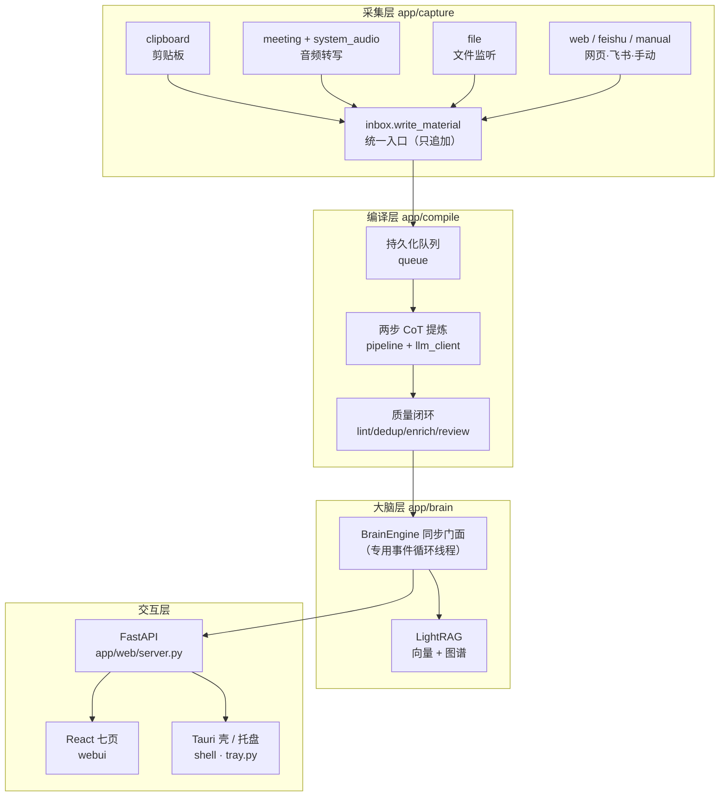
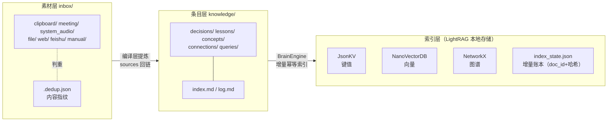
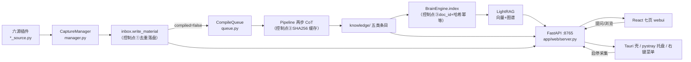

# 第 4 章 系统总体设计

本章在第 3 章需求分析的基础上给出系统总体设计：首先确立四层总体架构与职责边界，然后对六组关键设计决策进行备选方案对比与权衡论证，随后设计数据模型与存储方案，划分模块并定义接口，最后说明技术栈选型与两种部署形态。

## 4.1 总体架构设计

### 4.1.1 四层架构

系统采用"采集层 → 编译层 → 大脑层 → 交互层"的四层架构（图 4-1），层的划分依据是数据形态的逐级抽象：采集层产出原始素材（非结构化文本），编译层产出结构化知识条目（Markdown + frontmatter + wikilinks），大脑层将条目转化为可检索的向量与图谱索引，交互层面向用户提供问答、浏览与控制能力。上层只依赖下层的产物与接口，不允许跨层调用（例如交互层不直接读取 inbox，而一律经由 REST API）。

图 4-1 系统四层总体架构（终稿排版时重绘）

### 4.1.2 各层职责边界

（1）采集层（app/capture/）：以"来源插件 + 统一入口"组织。六个来源模块（clipboard_source、meeting_source、system_audio_source、file_source、web_source、feishu_source）各自实现监听与文本抽取，全部经由 base.py 定义的来源基类接入采集管理器（manager.py）统一调度启停；唯一的落盘入口是 inbox.py 提供的 write_material(source, title, content, meta)，保证素材格式与去重策略的一致性。

（2）编译层（app/compile/）：消费 inbox 中 compiled: false 的素材，经持久化队列（queue.py）调度，调用云端 LLM（llm_client.py）执行两步思维链提炼（pipeline.py），在上下文预算（context_budget.py）约束下产出五类知识条目，并以 lint/dedup/enrich/review 质量环节收尾。该层不感知任何前端接口，只对文件系统与队列状态负责。

（3）大脑层（app/brain/）：以 BrainEngine（engine.py）单一门面封装 LightRAG 引擎，对上提供 index/search/ask/graph 四个同步方法，对内管理专用事件循环线程、增量幂等索引与本地存储。该层是系统中唯一允许使用 asyncio 的模块。

（4）交互层：FastAPI 服务（app/web/server.py）以 REST API 汇集三层能力并托管前端构建产物；React 前端（webui/）实现七页界面；pystray 托盘（app/tray.py）、Windows 集成（app/win_integration.py）与 Tauri 壳（shell/）构成系统级入口。交互层不含业务逻辑，只做转发、聚合与展示。

这一职责切分直接映射了第 3 章的功能需求模块（表 3-1），并使三处幂等控制点分别内聚于采集、编译、大脑三层内部（对照图 3-2），任何一层均可独立重启与重跑。

## 4.2 关键设计决策与权衡

开发过程以架构决策记录（ADR，docs/adr/ADR-001~017）沉淀了全部关键技术决策。本节提取其中影响最大的六组，对比备选方案并论证取舍，汇总见表 4-1。

### 4.2.1 inbox 不可变追加模型 vs 就地编辑与数据库（ADR-013）

备选方案有三：JSONL 单文件、SQLite 数据库为主存储、单 md 文件只追加。系统选择第三种：素材以单 md 文件（YAML frontmatter + 正文）写入 inbox/<source>/，写入后不可变，提炼完成以 compiled 标记记录而非删除或改写原文。相比就地编辑，不可变模型使素材成为可审计、可重放的事实记录——编译流水线任何时候可以从零重跑；相比数据库存储，纯文本文件可被 Obsidian 等编辑器直接打开、可纳入版本管理，符合"可恢复优于查询强"的取向（仅 .dedup.json 等轻量指纹索引用文件实现）。代价是复杂查询需在上层构建（第 4.4 节的素材 API 承担），这在单用户规模下可接受。

### 4.2.2 编译层自研 vs 移植 llm_wiki 内核（ADR-008 → ADR-015）

ADR-008 确立"云端 LLM 提炼为五类条目"的目标后，实现方式存在两条路：从零自研提炼流水线，或移植开源项目 nashsu/llm_wiki 的 ingest 内核。系统选择移植，理由是：两步思维链编排、持久化队列、SHA256 缓存、上下文预算、去重与 lint 等环节在 llm_wiki 中已经过打磨，自研重复周期长且难以达到同等质量。移植是 TS→Python 的语义等价转换（并发模型改写为 Python 线程 + 队列），而非复制粘贴；移植文件头部注明 "Ported from nashsu/llm_wiki (GPL-3.0)"，参考源码本地化不进仓库。合规边界如实界定：本项目仅限个人自用不分发，未来任何分发前必须重评估许可（整体 GPL v3 开源或对相关模块 clean-room 重写）。KnowSeq 自有部分保留 inbox 适配、五类条目 schema、config 体系与 FastAPI 触发接口。

### 4.2.3 知识引擎选型：LightRAG vs GraphRAG vs 自研（ADR-009）

大脑层三选一：Microsoft GraphRAG 功能完整但建图开销大（需对全语料做社区摘要），对增量写入的个人知识库过重；自研轻量方案（sqlite-vec + NetworkX + LLM 抽实体）可控但工期长，图谱质量依赖自研抽取水平；LightRAG（lightrag-hku）以双层检索（低层实体/关系 + 高层主题）兼顾精度与成本，原生支持增量更新与引用溯源，且提供 Python 库形态可直接嵌入进程。系统选用 LightRAG，符合"现成组件 + 轻量自研"的总体策略；图增强检索的原理对比已在 2.2 节展开，此处不再重复。

### 4.2.4 桌面壳：Tauri 方案 A vs Electron vs sidecar 方案 B（ADR-016）

桌面化有三条路：Electron（Chromium 全量打包，体积与内存显著偏大）；Tauri 方案 B（PyInstaller 把 Python 后端打包为 sidecar 子进程随壳分发，体验最佳但构建重、调试复杂）；Tauri 方案 A（壳的 WebView 直接加载 http://127.0.0.1:8765，后端独立进程零改动）。系统以方案 A 起步：Origin 即本机地址，服务端 Host/Origin 校验天然放行；壳额外提供悬浮置顶控件、关窗隐藏到托盘与防多实例。同时为方案 B 预留三条演进接口：前端 API base 的环境变量前缀位、服务端放行 tauri.localhost Origin 的注释迁移说明、tauri.conf.json 的 externalBin/sidecar 配置位注释。该决策以最小代价获得桌面体验，又不对未来分发关闭大门。

### 4.2.5 音频捕获：WASAPI loopback 直采 vs 虚拟声卡 vs Rust 捕获（ADR-017）

会议场景需要采集"扬声器里播放的声音"。虚拟声卡方案（VB-Cable 等）依赖用户手动配置系统声音路由，体验差；会议软件 SDK 绑定特定应用无通用性；引入 Rust 侧捕获（cpal）性能更优但违背"Python 侧自研采集"路线并与既定转写链路冲突。系统选择 pyaudiowpatch 在 Python 侧直采默认输出设备的 loopback 混音：零用户配置、与转写链路（asr_infer 子进程）无缝衔接；代价是 loopback 抓取整机混音（系统提示音会混入），靠 300 秒定长分段与静音峰值检测缓解，麦克风混音可选且默认关闭。

### 4.2.6 BrainEngine 同步门面与 asyncio 内部化（m3 前置决策 D1~D6）

LightRAG 是 asyncio 库（ainsert/aquery），而系统的采集/编译层以同步线程模型实现。两种调和方式：全系统引入 asyncio，或把 asyncio 限制在大脑层内部。系统选择后者（D1）：在 app/brain/ 内以专用后台事件循环线程运行 LightRAG，经 run_coroutine_threadsafe 提交协程，对外暴露 index/search/ask/graph 同步接口——采集与编译层的线程风格完全不受影响，asyncio 的复杂性被封装在单一模块内。配套决策（D2~D6）：存储用 LightRAG 默认本地实现 JsonKV + NanoVectorDB + NetworkX，不引入 PostgreSQL/Neo4j/Redis；embedding 与问答 LLM 走 OpenAI 兼容配置，可在 brain.* 配置节覆盖；索引以"条目文件相对路径为 doc_id + 内容哈希"增量幂等；图谱导出为 {nodes, edges} JSON 供前端直接可视化；API Key 归属沿用 NFR-002 不新增敏感项。

**表 4-1 关键设计决策权衡对比总表**

| 决策点 | 备选方案 | 选定方案 | 关键理由 | 来源 |
|---|---|---|---|---|
| inbox 素材存储 | JSONL 单文件；SQLite 数据库 | 单 md 文件只追加 | 可读可审计可重跑；Obsidian 兼容 | ADR-013 |
| 编译层实现 | 自研流水线；外挂独立服务 | 移植 llm_wiki ingest 内核 | 质量与工期兼顾；GPL 边界如实声明 | ADR-008/015 |
| 知识引擎 | GraphRAG；自研 sqlite-vec | LightRAG（lightrag-hku） | 双层检索；增量更新；库形态嵌入 | ADR-009 |
| 桌面壳 | Electron；Tauri sidecar 方案 B | Tauri 方案 A（加载本机 URL） | 后端零改动；预留三条演进接口 | ADR-016 |
| 音频捕获 | 虚拟声卡；Rust cpal 侧 | pyaudiowpatch WASAPI loopback | 零用户配置；纯 Python 侧 | ADR-017 |
| 异步模型 | 全系统 asyncio；进程隔离 | 大脑层内专用事件循环线程 | 同步门面隔离复杂性 | m3 D1~D6 |

## 4.3 数据模型与存储设计

### 4.3.1 三级数据形态

系统数据沿"素材 → 条目 → 索引"三级形态组织（图 4-3），各级均为本地纯文件存储。

（1）素材层 inbox/：按来源分子目录（inbox/<source>/），文件名 <source>_<yyyyMMdd_HHmmss>_<短id>.md。frontmatter 固定五字段：id、source、captured_at（ISO 8601）、meta（来源标识，如 URL/会话/原文件路径）、compiled（幂等标记，初始 false）。clipboard/web/manual 三源以内容哈希指纹写入 inbox/.dedup.json 判重，screen 类/飞书/文件源按事件天然去重。

（2）条目层 knowledge/：编译层产出的五类知识条目——决策（decision）、教训（lesson）、概念（concept）、连接（connection）、疑问（query）——均为 Markdown 文件，frontmatter 含 type/title/created/updated/tags/related/sources，其中 sources 记录来源素材的相对路径（可审计回链的关键），related 与正文 wikilinks 构成条目间引用网络；query 类额外携带 status: open|resolved 字段以追踪开放问题。index.md 与 log.md 维护条目总目与变更日志。

（3）索引层：LightRAG 本地存储四件套——键值存储 JsonKV、向量存储 NanoVectorDB、图存储 NetworkX 图结构，以及系统自维护的 index_state.json 增量账本。

图 4-3 三级数据形态与存储结构（终稿排版时重绘）

### 4.3.2 幂等与增量设计

三级形态共享同一套幂等哲学：素材以 compiled 顶格标记防止重复消费；编译以内容 SHA256 缓存跳过未变化输入；索引以"doc_id（条目文件相对路径）+ 内容哈希"为增量判据（D4），内容未变的条目不重复触发建图，同时 index_state.json 账本只记录已成功处理的条目——"账本 = 已完成集合"这一不变量保证了任何中断（超时、崩溃）都会在下次扫描时自然重放，不会出现账本虚报而索引缺失的中间态。该不变量在 M5 验收中经受住了真实缺陷的检验（第 5.3 节详述修复案例）。

### 4.3.3 上下文预算

大模型上下文窗口是编译层的核心约束资源。系统采用字符制预算（默认 204800 字符）而非 token 计数，避免依赖分词器：系统提示、少样本示例与素材正文按比例（15%/5%/50%）分配配额，超长素材先经语义分块（REQ-208）再分段提炼。字符制的优点是与供应商无关、估算稳定，代价是精度略粗——对预算敏感度低的提炼任务而言是合理折中。

## 4.4 模块划分与接口设计

### 4.4.1 模块—目录—职责

表 4-2 给出模块、代码目录与职责的对应关系。

**表 4-2 模块—目录—职责表**

| 模块 | 目录 | 核心文件 | 职责 |
|---|---|---|---|
| 采集层 | app/capture/ | base.py、manager.py、inbox.py、六源 *_source.py | 来源插件接入、统一调度、素材落盘唯一入口 |
| 编译层 | app/compile/ | pipeline.py、queue.py、cache.py、llm_client.py、context_budget.py、lint/dedup/enrich/review | 队列调度、两步 CoT 提炼、缓存与质量闭环 |
| 大脑层 | app/brain/ | engine.py | BrainEngine 门面：增量索引、检索、带引用问答、图谱导出 |
| 服务与 API | app/web/ | server.py、dist/ | REST API、Host/Origin 校验、静态托管与 SPA fallback |
| 配置与横切 | app/ | config.py、main.py、tray.py、win_integration.py、run.py | 配置双轨、进程入口、托盘、注册表/自启集成 |
| 前端 | webui/ | src/pages/（七页）、src/api.ts | React 界面、图谱渲染、API 调用 |
| 桌面壳 | shell/ | Tauri 2.x 工程 | WebView 加载本机服务、悬浮控件、关窗隐藏、单实例 |

### 4.4.2 REST API 设计

FastAPI 服务绑定 127.0.0.1:8765，API 按资源分组（app/web/server.py，共 38 条路由）：采集控制（/api/status、/api/start、/api/stop、/api/start/{name}、/api/stop/{name}、/api/stop_all、/api/file_dirs/append）；素材导入与查询（/api/import、/api/import/file、/api/web/ingest、/api/feishu/doc、/api/materials、/api/materials/mark、/api/materials/content）；编译流水线（/api/compile/status、/api/compile/trigger、/api/compile/queue、/api/compile/retry、/api/compile/cancel、/api/compile/remove、/api/compile/reviews、/api/compile/reviews/resolve、/api/compile/lint、/api/compile/dedup、/api/compile/enrich）；知识条目（/api/knowledge 的 GET/PUT/DELETE）；大脑（/api/brain/status、/api/brain/index、/api/brain/query、/api/brain/search、/api/brain/graph）；系统设置与 Windows 集成（/api/settings、/api/context_menu/install、/api/context_menu/uninstall）。所有非根路径由 SPA fallback 兜底返回前端入口，保证 React 路由刷新可用。

接口设计遵循三条约定：其一，启停类操作以"资源 + 动词"命名（POST /api/start/{name}），无副作用查询用 GET；其二，问答返回体携带引用（来源条目文件路径），前端据此构造知识库跳转链接；其三，大脑类接口全部为同步阻塞式（内部等待事件循环完成），简化前端错误处理。

### 4.4.3 端到端数据流

图 4-2 从组件调用视角给出端到端数据流：来源插件经 manager 调度写入 inbox（控制点①）；pipeline 由队列驱动消费素材，经 LLM 提炼写 knowledge 条目（控制点②）；BrainEngine 扫描条目增量索引（控制点③）；前端七页与 Tauri 壳经 REST API 消费问答、图谱与状态，托盘与右键菜单经同一组 API 控制采集，保证多入口状态同源。

图 4-2 端到端数据流与组件调用关系（终稿排版时重绘）

## 4.5 技术栈选型与部署形态

表 4-3 按架构层汇总技术栈（版本与选型理由已在表 2-1 与 2.6/2.7 节详述，此处侧重分层归属）。

**表 4-3 技术栈选型表（按架构层）**

| 层 | 技术 | 用途 |
|---|---|---|
| 采集层 | watchdog、pyaudiowpatch、requests + readability-lxml、lark-oapi、pywin32 剪贴板轮询 | 文件监听、loopback 音频、网页正文、飞书长连接、剪贴板 |
| 本地转写 | VibeVoice-ASR-BitNet + VibeASR.cpp（外部引擎，子进程 asr_infer） | 本地 CPU 语音转写 |
| 编译层 | Python 3 + requests（SSE 流式）；移植 llm_wiki 内核 | 队列、提炼、缓存、质量闭环 |
| 大脑层 | lightrag-hku 1.5.7、bge-small-zh-v1.5（本地 embedding）、JsonKV/NanoVectorDB/NetworkX | 向量+图谱混合检索 |
| 交互层 | FastAPI + uvicorn；React 19 + Vite 6 + TypeScript；sigma.js v3 + graphology + ForceAtlas2 | API、前端、图谱可视化 |
| 桌面集成 | pystray、Tauri 2.x（Rust WebView）、Windows 注册表 | 托盘、桌面壳、右键菜单/自启 |

部署形态有两种：本机运行形态以 run.py 启动后端常驻进程（pystray 托盘 + 可选开机自启），浏览器或 Tauri 壳访问 127.0.0.1:8765，Node 与 Rust 工具链仅前端改码与壳构建时需要，日常使用只需 Python 环境；Tauri 桌面壳形态（方案 A）在之上叠加窗口与悬浮控件体验，后端仍为独立进程。两种形态共享同一数据目录与配置，可随时互换。

## 4.6 本章小结

本章确立了"采集—编译—大脑—交互"四层架构与层间职责边界，对六组关键决策（不可变 inbox、编译层移植、LightRAG 选型、Tauri 方案 A、WASAPI loopback、asyncio 内部化）完成了备选对比与权衡论证，设计了"素材—条目—索引"三级数据模型与三处幂等控制点，划分模块并定义了 REST API 约定，最后给出按层技术栈与两种部署形态。下一章进入各层的详细设计与实现。
