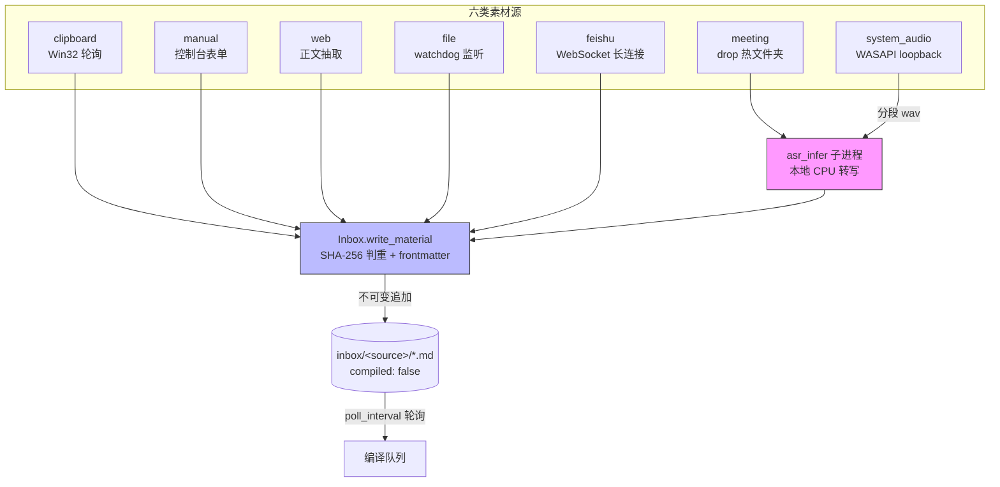
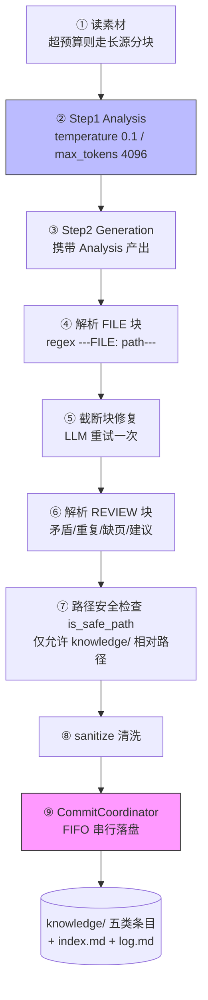
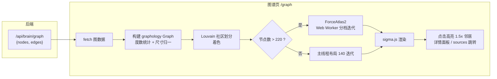
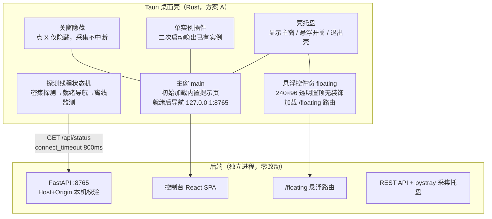

# 第 5 章 系统详细设计与实现

本章按四层架构自底向上展开各层的详细设计与实现：5.1 节介绍多源采集层，包括六类素材源的统一接入、不可变素材库的写入协议、Windows 剪贴板与系统声音两类操作系统级采集，以及本地 CPU 语音转写引擎的集成；5.2 节介绍知识编译层，包括内核移植的许可边界、九步编译流程、持久化队列、幂等缓存与质量闭环；5.3 节介绍知识大脑层，包括 LightRAG 引擎的同步门面封装、增量幂等索引，以及一次索引状态不一致缺陷的定位与修复案例；5.4 节介绍交互层的 REST 服务与 Web 前端实现；5.5 节介绍 Windows 桌面集成与 Tauri 桌面壳的实现。

## 5.1 多源采集层实现

### 5.1.1 六源统一入口与不可变素材库

采集层将六类自动源（clipboard、meeting、system_audio、file、web、feishu）与手动导入统一到同一写入口径上：所有素材无论来源，最终都由素材库（Inbox）的 `write_material` 方法写入 `inbox/<source>/` 目录，产出统一格式的 Markdown 文件。每类素材源实现自统一的 `CaptureSource` 基类，暴露 `start()/stop()/status()` 三个生命周期方法，由采集管理器统一以线程方式拉起，并通过 REST API 向控制台暴露运行状态。这一设计使"接入一个新素材源"被约束为"实现一个基类并在管理器注册"，采集线程的启停、状态上报、错误隔离均由框架统一处理。

素材文件遵循不可变追加模型（ADR-013）：文件一经写入只允许追加状态推进，不允许修改正文。写入协议的核心代码如下（代码 5-1）：

```python
# app/capture/inbox.py（节选）
def write_material(self, source: str, title: str, content: str,
                   meta: Optional[dict] = None, dedup: bool = True) -> Optional[Path]:
    """写入一条素材。返回文件路径；内容为空或重复（dedup=True）返回 None。"""
    source = (source or "").strip().lower()
    if source not in SOURCES:
        raise ValueError(f"未知素材来源: {source!r}")
    content = (content or "").strip()
    if not content:
        return None
    content_hash = self._content_hash(content)
    with self._lock:
        if dedup and content_hash in self._dedup:
            return None
        now = datetime.now()
        filename = f"{source}_{now.strftime('%Y%m%d_%H%M%S')}_{_safe_id(content)}.md"
        path = self.root / source / filename
        meta = meta or {}
        lines = [
            "---",
            f"id: {_safe_id(content)}",
            f"source: {source}",
            f"captured_at: {now.strftime('%Y-%m-%dT%H:%M:%S')}",
        ]
        if meta:
            # meta 内容来自外部（网页标题/窗口名/文件名等），必须走 YAML 转义，
            # 否则含冒号、换行、特殊符号的值会破坏 frontmatter 结构
            dumped = yaml.safe_dump(
                {str(k): v for k, v in meta.items()},
                allow_unicode=True, default_flow_style=False,
                sort_keys=False, width=10**9)
            lines.append("meta:")
            lines.extend("  " + ln for ln in dumped.rstrip("\n").splitlines())
        lines += ["compiled: false", "---", "", f"# {title or source}", "", content]
        path.write_text("\n".join(lines), encoding="utf-8")
```

代码 5-1 体现了四个设计要点：其一，来源（source）经白名单 `SOURCES` 校验，防止目录穿越与非法子目录；其二，以正文 SHA-256 指纹作为去重依据，在进程内锁的保护下查重——剪贴板、网页、手动导入三类"内容驱动"的源天然可能产生重复输入，指纹判重使同一内容多次复制只落盘一次（REQ-102）；其三，文件名由"来源_时间戳_内容短标识"构成，保证全局唯一且按目录即按来源分类；其四，frontmatter 携带五个固定字段（id、source、captured_at、meta、compiled），其中 `compiled: false` 是编译层的推进标记——编译成功后由 `mark_compiled` 回写为 `true` 并追加 `compiled_at`，这是素材侧唯一允许的状态改写。

meta 字段的写入值得单独说明：meta 中往往含网页标题、窗口名等外部内容，其中可能出现冒号、换行等 YAML 特殊字符。若直接以"key: value"文本拼接，会破坏 frontmatter 的结构完整性。实现中以 `yaml.safe_dump` 对整个 meta 字典做标准转义后再缩进嵌入，从机制上杜绝了此类损坏。

### 5.1.2 Win32 剪贴板监听与句柄截断缺陷的修复

剪贴板源面向"微信/企微对话即素材"的场景：用户在任意聊天窗口复制文本，系统在下一个轮询周期自动将其捕获入库。实现上采用 ctypes 直接调用 Win32 API 而不引入第三方剪贴板库，以保持依赖面最小（REQ-105）。

该模块在开发中暴露出一个典型的 64 位编程缺陷。初版实现未声明函数原型，ctypes 对未声明 `restype` 的函数默认按 32 位整数处理返回值，而剪贴板数据的全局内存句柄（HGLOBAL）在 64 位进程中是 64 位值——当句柄高 32 位非零时，返回值被截断为一个非法指针，随后的 `GlobalLock` 解引用直接触发 Access Violation 原生崩溃。修复方案是在模块加载时一次性声明全部 Win32 函数的 `argtypes` 与 `restype`（代码 5-2）：

```python
# app/capture/clipboard_source.py（节选）
CF_UNICODETEXT = 13

if hasattr(ctypes, "windll"):  # Windows：一次性声明 Win32 原型
    # 不声明 argtypes/restype 时，64 位下句柄被按 32 位截断成非法指针，
    # GlobalLock 后读内存直接 Access Violation —— 必须显式声明
    _user32 = ctypes.windll.user32
    _kernel32 = ctypes.windll.kernel32
    _user32.OpenClipboard.argtypes = [wintypes.HWND]
    _user32.OpenClipboard.restype = wintypes.BOOL
    _user32.IsClipboardFormatAvailable.argtypes = [wintypes.UINT]
    _user32.IsClipboardFormatAvailable.restype = wintypes.BOOL
    _user32.GetClipboardData.argtypes = [wintypes.UINT]
    _user32.GetClipboardData.restype = wintypes.HANDLE
    _kernel32.GlobalLock.argtypes = [wintypes.HGLOBAL]
    _kernel32.GlobalLock.restype = ctypes.c_void_p
    _kernel32.GlobalUnlock.argtypes = [wintypes.HGLOBAL]
    _kernel32.GlobalUnlock.restype = wintypes.BOOL
```

读取流程 `read_clipboard_text` 的健壮性处理同样必要：剪贴板是系统级单例资源，`OpenClipboard` 在被其他程序占用时会失败，此时返回 `None` 并等待下一轮轮询重试，而不是抛出异常中断采集线程；格式检查（`CF_UNICODETEXT`）过滤非文本内容；读取指针经 `ctypes.wstring_at` 按宽字符读到 NUL 终止符，并在 `finally` 块中保证 `GlobalUnlock` 与 `CloseClipboard` 成对执行。该缺陷的完整定位与修复过程记录于任务台账，其经验教训是：在 64 位进程中通过 ctypes 调用返回指针/句柄的 C 函数时，必须显式声明原型，任何"能跑就先跑"的省略都可能埋下仅在特定句柄值下才复现的随机崩溃。

### 5.1.3 系统声音的 WASAPI 环回采集

会议系统声音源（system_audio，REQ-109）解决"无法安装虚拟声卡或接入会议 API 时如何捕获远端音频"的问题。实现基于 pyaudiowpatch 库打开默认输出设备的 WASAPI loopback（环回）流——操作系统混音后送往扬声器的一切声音（会议软件的扬声器输出、本地媒体播放等）都可直接读取（ADR-017）。

该源在结构上有三个关键设计。第一，双线程解耦：录音线程只负责按固定时长分段落盘（默认 300 秒/段，下限 30 秒，可配置），转写线程从内存队列按序消费分段文件调用转写引擎。由于本地 CPU 转写的实时率（RTF）小于 1 但显著非零，若采转同步执行必然漏录音频；队列化解耦后，转写耗时不再影响录音的连续性，停止采集时转写线程会清空队列完成"最后一段落稿"再退出。第二，静音段过滤：会议中的静默期属正常现象，而转写引擎对纯静音输入不产出任何文本，直接送转写会造成误报。实现中以段峰值幅度检测跳过静音段（代码 5-3）：

```python
# app/capture/system_audio_source.py（节选）
CHUNK = 1024            # 循环回放流每次读取帧数
SILENCE_PEAK = 100      # 段峰值幅度低于此值视为纯静音（跳过转写：asr_infer 对静音无输出）

@staticmethod
def _is_silent(p: Path) -> bool:
    """段峰值幅度检测：纯静音段（峰值 < SILENCE_PEAK）无语音内容。

    会议中的静默期属正常现象，纯静音输入会让 asr_infer 无输出而误报
    error——此处跳过转写，避免误报并省去无效推理。
    """
    try:
        import numpy as np
        with wave.open(str(p)) as wf:
            raw = wf.readframes(wf.getnframes())
            peak = int(np.abs(np.frombuffer(raw, dtype=np.int16)).max())
            return peak < SILENCE_PEAK
    except Exception:
        return False  # 异常时按非静音处理，宁可多转写不可漏转写
```

第三，哨兵流与设备切换处理。WASAPI loopback 在系统无活跃渲染流时不产生数据（读操作阻塞），若会议进入静默期且无任何媒体播放，分段定时、设备探测与停止收尾都会失去驱动。实现向默认输出设备并行渲染一条静音"哨兵流"，保持音频引擎持续活跃，使分段与收尾在静音期同样可靠（该思路参考开源项目 Meetily 的 WASAPI 采集方案，MIT 许可）。此外，当默认输出设备切换（如插入耳机）时，采集流会自动关闭当前段并重建，已落盘分段照常入队，不丢失音频。

可选配置 `include_mic`（默认关闭）允许将默认麦克风混入录制，用于"远端声音 + 本地发言"的完整会议记录；由于 loopback 与麦克风的采样率可能不同，混入前经 numpy 线性重采样对齐。分段文件临时存放于 `inbox/.system_audio/`（素材库源扫描范围之外），转写成功后方以 meeting 源口径写入 `inbox/meeting/` 并以 `meta.capture = "system-audio"` 标记，保证下游编译层以统一的"会议素材"口径处理。

### 5.1.4 本地 CPU 语音转写引擎

语音转写采用 VibeVoice-ASR-BitNet 方案（外部引擎，ADR-014）：以 C++ 实现的 VibeASR.cpp 推理程序 `asr_infer.exe` 为子进程，在纯 CPU 环境执行语音识别，线程数配置为 4。选型依据是本地化与中文表现的平衡：该引擎在 AISHELL-4 与 AliMeeting 两个中文会议语料上的字错误率分别为 27.45% 与 40.58%（中文场景按字错误率口径），实时率约 0.71（CPU 推理可快于实时），完全离线运行、音频数据不出本机，符合本系统"个人知识资产本地化"的定位（测试数据详见第 6 章）。

采集层对转写引擎的集成以"子进程 + 会话隔离"为边界：每段音频文件触发一次 `asr_infer` 子进程调用，子进程异常退出（含 Windows fail-fast 崩溃）只影响当前段，失败段在会话内隔离记录、不重试、不产出空稿，避免单段异常扩散为整场会议失败。系统声音源完全复用会议源（meeting）的这段转写链路，仅多出"环回采集 + 分段"的上游差异，这体现了采集层"多源汇入同一转写/落盘管线"的复用设计。

### 5.1.5 文件、网页、飞书与手动源

其余四类素材源的接入相对轻量，共用 5.1.1 节的写入协议：

（1）文件源（file）基于 watchdog 监听用户指定的收集目录（drop 目录），新文件落入即触发捕获，适配"随手把下载的资料丢进文件夹"的习惯；（2）网页源（web）以 requests 拉取页面，经 readability-lxml 做正文抽取，剥离导航、广告等噪声后仅正文入库，并以内容哈希判重防止同一页面反复抓取；（3）飞书源（feishu，REQ-501 相关）通过 lark-oapi SDK 的 WebSocket 长连接接收消息事件，免公网回调地址即可在个人开发环境运行，凭据走环境变量不落盘；（4）手动导入（manual）提供控制台表单，用于粘贴无法自动捕获的内容。六类源的运行时启停、状态与错误信息均由采集管理器汇总，经 REST API `/api/status` 与 `/api/start/{name}`、`/api/stop/{name}` 对控制台暴露，实现"单面板总览全部采集通道"的运维体验。

采集层各源与素材库的整体数据流如图 5-1 所示。



<div align="center">图 5-1 采集层六源流程图（Mermaid 草稿，终稿重绘）</div>

## 5.2 知识编译层实现

### 5.2.1 内核移植边界与许可合规

编译层的任务调度、两步提炼、缓存、lint、去重、链接补全等核心机制移植自开源项目 nashsu/llm_wiki（GPL-3.0 许可）的 TypeScript 内核，按本系统需求做了面向 Python 的重写与裁剪。在此须明确声明移植边界与合规立场：第一，移植仅限本人在本地个人使用，不分发、不商用，符合 GPL-3.0 的义务边界；第二，所有移植文件均在文件头以注释标注来源（如 queue.py 头部"Ported from nashsu/llm_wiki (GPL-3.0)"），不抹除出处；第三，移植是骨架级重写而非逐行翻译——九类条目体系改为本系统五类，项目切换逻辑裁剪为单项目，Promise 链改为 threading.Condition，前端图谱布局参数则保留了来源标注。本节如实区分"移植自 llm_wiki 的机制"与"本系统自有的设计"，后者主要包括：compiled 状态推进标记（llm_wiki 无此机制）、五类条目 SCHEMA、query 条目的 open/resolved 状态，以及与本系统采集层/大脑层的全部胶合层。

### 5.2.2 九步编译流程与两步 CoT

编译核心 `compile_one` 将单条素材转化为知识条目，采用九步流程（图 5-2，REQ-207）：



<div align="center">图 5-2 编译层九步流程图（Mermaid 草稿，终稿重绘）</div>

流程的核心是两步思维链（two-step CoT）：Step 1（Analysis）以低温度（temperature 0.1）、受限输出长度（max_tokens 4096）执行，任务是从素材中提取"值得沉淀的知识点清单与相互关系"，低温度保证分析的稳定与克制；Step 2（Generation）携带 Step 1 的分析结果执行生成，按内置中文 SCHEMA 产出若干 FILE 块——每个块对应一个知识条目文件，格式为 `---FILE: <路径>---` 与 `---END FILE---` 之间的完整 Markdown 文档。将"分析"与"生成"拆为两次调用而非要求模型一步到位，是移植内核的核心经验：混合任务下模型容易顾此失彼，拆分后每步的提示词职责单一，条目质量明显更稳。

生成文本的解析与防御占据流程后半段：正则解析出 FILE 块后，对内容被输出上限截断的块（缺失结束标记）发起一次 LLM 修复重试；解析 REVIEW 块收录模型在阅读素材时发现的矛盾、疑似重复、缺页与建议四类审读意见（type ∈ contradiction/duplicate/missing-page/suggestion），持久化为待办供控制台标记解决（REQ-210）；随后执行路径安全检查 `is_safe_path`——LLM 产出的写入路径只允许为 knowledge/ 目录下的相对路径，任何越界路径（绝对路径、`..` 回溯、系统目录）一律拒绝，这是"把 LLM 输出当不可信输入"的边界设计；最后经 sanitize 清洗，交由 CommitCoordinator 落盘。

### 5.2.3 持久化编译队列与限流自适应

素材到编译的衔接由持久化队列（CompileQueue）承担（REQ-206）。编译管理器以固定间隔（默认 30 秒，`compile.poll_interval`）扫描素材库中 `compiled: false` 的素材自动入队；队列状态机为 pending → processing → 完成移除 / failed / cancelled，失败未达上限回 pending 重试。队列的关键参数与限流判定如下（代码 5-4）：

```python
# app/compile/queue.py（节选）
MAX_RETRIES = 3
USAGE_LIMIT_PAUSE_S = 15 * 60  # 429 后自动恢复间隔
USAGE_LIMIT_RE = re.compile(
    r"\b429\b|rate[_\s-]*limit|usage\s+limit|quota|too many requests",
    re.IGNORECASE)

def is_usage_limit_error(message: str) -> bool:
    """限流类错误判定（对应源码 isUsageLimitError）。"""
    return bool(USAGE_LIMIT_RE.search(message))
```

三类容错设计值得说明。其一，持久化与崩溃恢复：队列整体持久化为 `.knowseq/compile-queue.json`，进程被 kill 后重启，所有 processing 状态一律重置回 pending——"正在编译"不是可恢复的中间态，重置保证崩溃的任务必然被重新调度。其二，限流自适应：LLM 服务返回 429（超限/限流）类错误时，按错误消息正则识别后全队列暂停 15 分钟自动恢复，同时中止同批兄弟任务回 pending，避免在限流窗口内徒劳重试消耗配额。其三，落盘串行化：worker 线程池并发编译（默认 1 并发，上限 5），但写 knowledge/ 的最后一步必须经 CommitCoordinator 以 FIFO 串行执行，避免两个任务同时维护 index.md 与 log.md 产生交错损坏。重试上限 3 次（MAX_RETRIES），超限任务标记 failed 并保留错误消息供控制台查看。

### 5.2.4 幂等控制：编译标记与双条件内容缓存

编译层设两道幂等防线（REQ-205）。第一道是素材侧的 `compiled` 标记：编译成功后回写 `compiled: true`，扫描器据此跳过已编译素材，防止重复入队。第二道是内容缓存（IngestCache）：以素材正文的 SHA-256 为键缓存"该内容曾编译产出哪些文件"，命中条件是双重的——内容哈希相同，且上次产出的全部文件在 knowledge/ 中仍然存在。双条件缺一不可：只有哈希条件时，用户手动删除某条目后重编会被缓存拦截而无法恢复；只有文件条件时，相同内容的素材仍会重复消耗 LLM 调用。缓存持久化为 `.knowseq/compile-cache.json`，与队列、断点同置于 `.knowseq/` 运行态目录。

### 5.2.5 上下文预算与长源分块

LLM 的上下文窗口是编译层最刚性的约束。实现采用字符制预算（不引入 tokenizer，P3 决策）：总预算默认 204800 字符（`compile.llm.max_context`，与火山方舟 deepseek-v4-flash 的上下文规模匹配），内部按固定比例划分为系统提示区（15%）、少样本示例区（5%）与素材区（50%），剩余作为响应预留；素材区内部再限定单页上限（素材区的 30%，下限 5000 字符），防止单条超长页面挤占其他内容。字符制牺牲了 token 精度换来了零依赖与确定性——中文场景下字符与 token 的换算比例相对稳定，比例式预算足以胜任。

超出素材区上限的超长素材走长源分块编译（REQ-208）：按语义边界切分为重叠分段（重叠量在 800～3000 字符间自适应，防止知识在切分处断裂），每段单独走两步提炼，目标产出按预算的 55% 控制，为分段间的合并预留空间；分块进度以 checkpoint 持久化（`.knowseq/compile-checkpoints/`），中断重启后从断点续跑而非从头再来。编译完成后由 indexer 维护 knowledge/ 的 index.md（按五类分区与标题索引）与 log.md（编译流水），保证知识库始终自带目录与变更记录。

### 5.2.6 质量闭环：lint、去重、链接补全与审读

编译产出后的质量维护形成四个相互衔接的闭环环节（REQ-209/210/211/212）：

（1）结构化 lint：全库扫描三类问题——断链（wikilink 指向不存在的条目）、同名（不同分区下同名条目）、重复候选（CJK 相似度加权）。断链的默认处置是自动创建 `type: query` 的占位条目（stub）而非删除链接：断链本身是"知识缺口"的信号，占位条目使缺口显性化，等待后续素材补全（P6 决策）。

（2）知识去重（dedup）：随素材积累，不同批次提炼的条目可能出现语义重复。去重流程为"预筛 → LLM 批扫 → 合并"三段：先以轻量相似度预筛（阈值 0.68）缩小候选集，再以 80 条/批、批间重叠 8 条的方式让 LLM 输出重复分组 JSON，最后执行合并并保留各条的 related 与 sources 溯源；"非重复"判定持久化为白名单，避免同一对条目被反复检出。超过 250 页时不再全库扫描（直接返回空结果），防止批扫时间失控。

（3）链接补全（enrich）：遍历既有条目，由 LLM 建议相关条目并补充 wikilink，建议经"目标条目确实存在"校验后写入 frontmatter 的 related 与正文，手动触发执行。这一环节主动增加条目间的关联密度，而关联密度直接决定大脑层图谱的连通性。

（4）审读闭环（review）：5.2.2 节解析出的四类审读意见持久化为 ReviewItem（open/resolved 状态，内容派生稳定 id 防重复登记），在控制台可见并可人工标记解决，构成"机器审读 + 人工确认"的轻量闭环。

### 5.2.7 五类知识条目的模式定义

五类条目的语义划分是编译层的输出契约，也是大脑层索引的输入约定：decision（决策）记录"做了什么选择、为什么"；lesson（经验教训）记录"踩过什么坑、如何避免"；concept（概念）记录"是什么、与什么相关"；connection（关联）记录条目间显式关联；query（待办问题）记录"什么问题尚未解决"，以 `status: open/resolved` 追踪生命周期。条目 frontmatter 统一为 type/title/created/updated/tags/related/sources 七字段：sources 指回素材来源文件，是"条目 → 素材"的逆向溯源链；related 承载 wikilink 关联网。这一 schema 与第 4 章 4.3 节的数据模型设计一致，内置为 SCHEMA 常量随提示词下发，不依赖运行时读取外部 schema 文件。

## 5.3 知识大脑层实现

### 5.3.1 LightRAG 集成与本地存储

大脑层选用 LightRAG（lightrag-hku 1.5.7）作为检索引擎（ADR-009，选型对比见 4.2.3 节）：相比朴素 RAG 只做向量检索，LightRAG 在索引期从文本中抽取实体与关系构建轻量知识图谱，查询期支持 naive（纯向量）、local（实体邻域）、global（主题层级）、hybrid（local+global 融合）与 mix（向量+图谱混合）五种模式，以一套引擎覆盖"找原文片段"与"问关系脉络"两类查询需求。工程上重要的是其存储形态：LightRAG 支持以纯文件实现全部存储（键值 JsonKV、向量 NanoVectorDB、图结构 NetworkX），无需部署数据库服务，数据全部位于项目的 `.knowseq/brain/` 目录下，与"单用户、本地部署、零外部服务"的系统定位完全匹配；分块参数 `chunk_token_size` 设为 1200，与中文知识条目的篇幅量级适配。

索引与问答所需的两个模型均走 OpenAI 兼容端点（D3 决策）：向量嵌入默认本地模式，加载 `models/embed/bge-small-zh-v1.5`（中文小规模嵌入模型）在 CPU 上推理，嵌入成本为零且离线可用；问答 LLM 缺省复用编译层的 `compile.llm.*` 配置（本系统配置为火山方舟 deepseek-v4-flash），亦可通过 `brain.llm.*` 独立指定——两处模型职责不同（问答需要更好的指令遵循与引用能力，编译需要长上下文），解耦配置允许按需分别选型。API Key 复用环境变量 `LLM_API_KEY`，与编译层共用一份凭据且不落日志（D6）。

### 5.3.2 BrainEngine 同步门面与 asyncio 内部化

LightRAG 是 asyncio 风格的库，而本系统采集层与编译层已确定以 threading 为并发基调（P2 决策）。若让上层直接面对 asyncio，调用方将不得不区分"同步方法"与"异步方法"两套语义，或者在每处调用点手工管理事件循环。为将 asyncio 完全内部化，BrainEngine 以同步门面（facade）模式封装引擎：内部维护一个专用的后台事件循环线程，所有 LightRAG 操作以协程工厂方式提交到该循环，对外仅暴露同步方法（M3 决策 D1）。核心提交逻辑如下（代码 5-5）：

```python
# app/brain/engine.py（节选）
def _run(self, coro_factory, timeout: float | None = 900) -> object:
    """在 brain loop 中运行协程工厂并同步等待结果。"""
    self._ensure_loop()
    fut = asyncio.run_coroutine_threadsafe(coro_factory(), self._loop)
    return fut.result(timeout=timeout)

def _run_safe(self, coro_factory, timeout: float | None = 900) -> object | None:
    try:
        return self._run(coro_factory, timeout=timeout)
    except Exception:  # noqa: BLE001 — 调用方兜底
        return None
```

实现要点有三：其一，`run_coroutine_threadsafe` 是线程安全的提交原语，任意业务线程都能将协程投递到大脑线程执行，`Future.result(timeout)` 完成跨线程同步等待；其二，以协程工厂（`coro_factory`）而非协程对象为参数，保证协程在提交时刻才创建，避免协程在错误的线程中启动；其三，`_run_safe` 将异常收敛为 `None` 返回值供调用方兜底——这一"吞异常返回 None"的约定在 5.3.4 节的缺陷案例中被证明需要配合严格的返回值检查使用，是本系统一次有代表性的教训。

门面对外仅暴露四个能力，与 REQ-302~305 一一对应：`index()` 增量索引、`search()` 纯向量检索、`ask(mode)` 带引用问答、`graph()` 图谱导出。引擎未启动或配置缺失时，各方法返回明确的"未就绪"状态而非抛错，使交互层可以据此降级展示。

### 5.3.3 增量幂等索引与状态账本

大脑层面临的索引问题与编译层同构：knowledge/ 目录会随编译不断演进，而全量重建索引意味着对全部条目重新执行 LLM 实体抽取，成本不可接受。为此 `index()` 实现增量幂等语义：以条目文件的相对路径为文档 ID（doc_id），以内容 SHA-256 为变更判据，索引状态账本 `index_state.json` 记录"路径 → 内容哈希"，每次索引只提交哈希有变化的条目（代码 5-6）：

```python
# app/brain/engine.py（节选）
def index(self, knowledge_dir: Path, *, full_rebuild: bool = False) -> dict:
    """五类条目增量索引；full_rebuild 清空工作目录全量重建。"""
    kd = Path(knowledge_dir)
    docs = self._collect_docs(kd)
    if full_rebuild:
        self.stop()
        shutil.rmtree(self._working_dir, ignore_errors=True)
        self.start()
        state: dict[str, str] = {}
    else:
        state = self._load_state()
    to_insert = [(rel, text) for rel, text in docs
                 if state.get(rel) != _sha256(text)]
    done = True
    if to_insert:
        rag = self._require_rag()
        texts = [t for _, t in to_insert]
        rels = [r for r, _ in to_insert]
        # ainsert 超时/失败（_run_safe 吞异常返回 None）时不得入账 state，
        # 否则状态不一致（LightRAG 侧仍 parsing）且增量重试永不触发。
        done = self._run_safe(
            lambda: rag.ainsert(texts, ids=rels, file_paths=rels),
            timeout=7200) is not None
    if done:
        for rel, text in to_insert:
            state[rel] = _sha256(text)
        self._save_state(state)
    return {"scanned": len(docs), "inserted": len(to_insert),
            "skipped": len(docs) - len(to_insert), "state_saved": done}
```

该实现遵循一条贯穿本系统的状态一致性不变量：**账本必须等于已完成的集合**——`index_state.json` 中的一条记录，当且仅当 LightRAG 侧对应文档已成功完成索引。删除场景同样遵守不变量：`remove(doc_id)` 调用 LightRAG 的 `adelete_by_doc_id` 清除向量与图谱数据，并同步清理账本条目，两侧对称删除（REQ-409 索引一致性）。全量重建（`full_rebuild`）则将工作目录整体清空后重跑，作为状态彻底失序时的兜底手段。

### 5.3.4 索引状态缺陷的定位与修复

增量索引机制在系统验收阶段暴露过一个有代表性的缺陷，其定位与修复过程完整记录于 M5 验收文档，本节将其作为工程案例展开（这也是第 4 章 4.3 节幂等设计的一个反例验证）。

**现象**：端到端验收中，问答与纯向量检索均无法命中本轮会议素材提炼出的新条目。

**定位**：检查 LightRAG 的内部文档状态表（kv_store_doc_status.json），发现 54 条文档长期停留在 parsing（解析中）中间态——既非 processed 也非 failed；而对照 `index_state.json` 账本，这 54 条文档已被入账。两侧状态组合出一个矛盾：引擎账本认为"已索引"、LightRAG 实际"未完成"，增量比较的哈希判断于是永远判定"无变化"，重试永不触发。追溯发现该不一致自更早的里程碑版本即已存在。

**根因**：旧版 `index()` 在调用 `ainsert` 时以 `_run_safe(timeout=1800)` 包裹，超时或异常时 `_run_safe` 吞掉错误返回 None，而调用方未检查返回值，无条件将内容哈希写入账本。两个因素叠加：一是"吞异常默认成功"的错误假设，二是 1800 秒超时对约 50 条文档的批量插入明显偏短——实测该环境下 LightRAG 的索引吞吐约为每分钟 0.7 条（每条都要经历 LLM 实体抽取），1800 秒只够处理约 21 条，后续文档必然超时。另一个深层事实是：LightRAG 的 `wait_for` 超时只是上层不再等待，其内部 pipeline 仍会继续执行，因此被"放弃等待"的文档可能长时间处于 parsing 态。

**修复**：代码层面两处改动——其一，`ainsert` 失败/超时（返回 None）时不得写入账本，返回体新增 `state_saved` 字段显式告知调用方账本是否推进（即代码 5-6 所示的修复后形态）；其二，超时上限 1800 秒调整为 7200 秒，覆盖 50 条量级的批量插入。数据层面在后端停止状态下手术清理：清除状态表中全部 54 条 parsing 残留，按不变量剔除账本中的 stale 条目，重启后系统自动增量重插 49 条，全部收敛为 processed；再次增量索引返回 `{"scanned":122,"inserted":52,"skipped":70,"state_saved":true}`，账本 122 条全量与 LightRAG 侧一致。

**经验**：该案例沉淀出两条一般性教训。其一，封装层"吞异常返回 None"的容错函数，其调用方必须以返回值判断成败，任何"调用即成功"的默认假设都会在状态机中制造僵尸中间态；其二，跨系统状态同步必须定义唯一不变量（此处为"账本 = 已完成集合"）并以代码显式维护，中间态只能存在于事务内部，不能被登记到持久账本中。

### 5.3.5 检索与问答

问答链路自前端发起，经 FastAPI 转发至 BrainEngine，再投递到大脑事件循环执行 LightRAG 查询，整体时序如图 5-3 所示。

```mermaid
sequenceDiagram
    participant U as 前端问答页
    participant API as FastAPI
    participant BE as BrainEngine（同步门面）
    participant L as 大脑事件循环线程
    participant R as LightRAG
    participant LLM as 问答 LLM（OpenAI 兼容）

    U->>API: POST /api/brain/ask {query, mode, top_k}
    API->>BE: ask(query, mode)
    BE->>L: run_coroutine_threadsafe(coro)
    L->>R: aquery(query, QueryParam)
    R->>LLM: 实体/关系抽取结果 + 上下文组装
    LLM-->>R: 生成回答（含引用上下文）
    R-->>L: answer + contexts
    L--->>BE: fut.result(timeout)
    BE-->>API: {answer, contexts[], mode}
    API-->>U: JSON 响应
    U->>U: 渲染回答 + 引用跳转（来源条目/图谱）
```

<div align="center">图 5-3 大脑层索引/查询时序图（Mermaid 草稿，终稿重绘）</div>

查询模式以参数暴露，前端问答页默认 hybrid 模式（实体邻域与主题层级融合），第 6 章将对五种模式开展对比实验。返回体除答案文本外携带 `contexts`（被引用的知识片段及其来源条目路径），这是交互层"引用可跳转"闭环的数据基础；`search()` 则只做 naive 向量检索返回片段列表，供需要"原文出处"而非"综合回答"的场景使用。`graph()` 将 LightRAG 内部图导出为 {nodes, edges} JSON——节点即实体、边为关系——经 `/api/brain/graph` 供前端图谱页渲染，节点携带的 source_id 可反解为来源条目，实现"图谱节点 → 来源文件"的跳转（实现见 5.4.3 节）。

## 5.4 交互层实现

### 5.4.1 FastAPI 服务与本机访问限制

交互层服务端以 FastAPI 实现，uvicorn 承载，监听 127.0.0.1:8765。REST API 共 38 条路由，按资源分组：系统状态与采集开关（/api/status、/api/start、/api/stop 及单源启停）、素材（列表/详情/手动导入）、编译（队列快照/入队/暂停恢复/重试/编译产物）、知识条目（浏览/编辑/删除/重建索引）、大脑（索引/检索/问答/图谱/嵌入配置）、Windows 集成（右键菜单与自启的安装卸载查询）。请求体经 Pydantic 模型校验，非法参数返回 422，业务异常统一转为携带中文错误信息的 JSON 响应——前端据此在界面内展示失败原因，而不是抛出裸堆栈。

安全设计上，服务端实施"仅限本机访问"（REQ-110）。值得注意的是，仅校验 Host 头是不够的：跨站表单或 multipart 提交时 Host 同样是本机，恶意页面可以借受害者的浏览器向 127.0.0.1:8765 发起跨站请求（CSRF 类攻击面）。因此中间件同时校验 Host 与 Origin（代码 5-7）：

```python
# app/web/server.py（节选）
@app.middleware("http")
async def local_only(request: Request, call_next):
    if not _is_local(_host_part(request.headers.get("host", ""))):
        return JSONResponse({"detail": "仅允许本机访问"}, status_code=403)
    origin = request.headers.get("origin")
    if origin:
        try:
            origin_host = urlsplit(origin).hostname or ""
        except ValueError:
            origin_host = ""
        if not _is_local(origin_host):
            return JSONResponse({"detail": "拒绝跨站请求"}, status_code=403)
    return await call_next(request)
```

其中 `_is_local` 仅接受 localhost、127.0.0.1 与 [::1] 三种主机名（兼容带端口形式）。该中间件与 Tauri 桌面壳协同良好：壳直接加载 `http://127.0.0.1:8765`，其 Origin 即本机，校验零改动；代码注释中同时为未来演进预留了口子——若迁移到"壳内嵌静态资源经 Tauri 自定义协议访问"的方案 B，WebView 的 Origin 将变为 `http://tauri.localhost`，届时需在此放行（ADR-016）。

### 5.4.2 React 七页路由与状态联动

前端以 React 19 + Vite 6 + TypeScript 构建，构建产物由后端 FastAPI 以静态资源方式直接托管——部署上只需要一个 Python 进程，浏览器或桌面壳访问 8765 端口即得完整控制台。页面共七路由：问答（/ask，默认页，根路径重定向至此）、图谱（/graph）、知识库（/knowledge）、编译（/compile）、素材（/materials）、采集（/capture）、设置（/settings），覆盖第 3 章用例分析中"按需使用"与"系统控制"两组用例的全部操作面。

各页面的数据联动遵循统一模式：以 fetch 封装调用 REST API，对耗时操作（索引、去重、编译）采用"发起任务 + 定时轮询进度"的交互形态，避免长连接与 SSE 的额外复杂度。采集页以卡片形式呈现六源运行状态与启停控制；编译页呈现队列快照（pending/processing/failed 各态计数）与限流暂停状态；设置页汇集 LLM/嵌入模型/采集源参数，并对敏感项（API Key）只读展示、只允许经环境变量配置。

### 5.4.3 图谱可视化：sigma.js + ForceAtlas2 + Louvain

图谱页（/graph）承担知识网络的可视化，技术栈为 sigma.js v3 + graphology：后端 `/api/brain/graph` 返回 {nodes, edges}，前端构建 graphology 图对象后依次执行三步预处理——Louvain 社区划分、节点尺寸按度数归一、布局坐标计算——再交给 sigma 渲染。三个实现决策如下。

其一，布局算法采用 ForceAtlas2 力导向布局，并在节点数超过阈值（220）时转入 Web Worker 执行，避免布局迭代阻塞主线程造成界面卡死。迭代次数按规模分档而非固定值：小图多迭代求精细布局，大图少迭代保可用性（代码 5-8）：

```typescript
// webui/src/lib/graph.ts（节选）
/* ---- 布局参数（Ported from nashsu/llm_wiki (GPL-3.0)） ---- */
export const WORKER_LAYOUT_NODE_THRESHOLD = 220;

/** 迭代分档：>600/1200/2500 → 65/40/28，>250 → 90，其余 140 */
export function layoutIterations(nodeCount: number): number {
  if (nodeCount > 2500) return 28;
  if (nodeCount > 1200) return 40;
  if (nodeCount > 600) return 65;
  if (nodeCount > 250) return 90;
  return 140;
}
```

其二，社区着色采用 Louvain 算法（graphology-communities-louvain）划分社区，同一社区的节点着同色，用户可直观分辨知识网络的"话题簇"；社区划分失败（单节点图、无边图）时降级为全部归入社区 0，保证渲染流程不中断。

其三，交互层通过 sigma 的 nodeReducer/edgeReducer 实现动态样式：点击节点时将其邻居边加粗、非邻域元素淡出，突出局部关系；详情面板展示节点的 label、类型、度数与关连边列表。需要特别说明的是，LightRAG 图谱节点的 id 是实体名称而非知识条目文件路径，因此"图谱节点 → 来源条目"的跳转不依赖节点 id，而是利用节点携带的 `sources` 字段（后端由 LightRAG 的 source_id 反解为条目相对路径）实现，这一细节使图谱页与知识库页得以无缝衔接。

图谱页的整体结构与渲染流程如图 5-4 所示。



<div align="center">图 5-4 前端页面结构与图渲染流程（Mermaid 草稿，终稿重绘）</div>

### 5.4.4 问答引用与三视图闭环

问答页（/ask）是系统的主入口，围绕"答案可信、可追溯"设计：回答以流式文本呈现，答案下方列出引用列表——每条引用展示来源条目标题与命中片段摘要，点击即可跳转知识库页定位到具体条目；条目页内又可经 sources 字段溯源到原始素材；图谱页则提供"这条知识与全局网络的关系"视角。由此形成"答案 → 条目 → 素材"与"条目 → 图谱"两组跳转链，覆盖知识消费场景中"结论、原文、语境"三种粒度，这是第 3 章 REQ-405/REQ-407 需求的最终实现形态。

## 5.5 Windows 集成与桌面壳实现

### 5.5.1 采集托盘与注册表集成

系统在 Windows 桌面侧的集成遵循一个原则：全部能力走 HKCU 注册表（当前用户配置单元），不需要管理员权限，卸载亦无残留（ADR-011）。集成包含三部分。

第一，采集托盘（pystray 实现，app/tray.py）：后端常驻进程在托盘驻留图标，提供采集总开关（开始/停止全部源）、打开控制台与退出入口，让"后台一直在采集"对用户可见可控。

第二，目录右键菜单（REQ-506）：向 `HKCU\Software\Classes\Directory\shell` 写入两个菜单项，"纳入 KnowSeq 采集"将选中目录追加为采集任务、"立即结束采集"触发 stop_all；菜单命令以 pythonw（无控制台窗口的 Python 解释器）静默调用 scripts/context_menu.py 脚本，脚本再请求本地 HTTP API（代码 5-9）。以"注册表 → 静默脚本 → 本机 API"的间接链路替代直接注册 COM/Shell 扩展，把 Windows 集成的复杂度收敛为一个纯 Python 模块（代码 5-9）：

```python
# app/win_integration.py（节选）
MENU_KEY = r"Software\Classes\Directory\shell"
RUN_KEY = r"Software\Microsoft\Windows\CurrentVersion\Run"
AUTOSTART_NAME = "KnowSeq"
# (子键名, 菜单文案, 触发动作) —— 顺序即安装/卸载对象全集
MENU_ITEMS = (
    ("KnowSeq.Capture", "纳入 KnowSeq 采集", "append"),
    ("KnowSeq.Stop", "立即结束采集", "stop_all"),
)

def _pythonw() -> str:
    """当前解释器同目录的 pythonw.exe（venv 下即 .venv\\Scripts\\pythonw.exe）。"""
    return str(Path(sys.executable).with_name("pythonw.exe"))

def install_context_menu() -> None:
    for key_name, label, action in MENU_ITEMS:
        with winreg.CreateKey(winreg.HKEY_CURRENT_USER, rf"{MENU_KEY}\{key_name}") as k:
            winreg.SetValueEx(k, None, 0, winreg.REG_SZ, label)  # 默认值 = 菜单文案
        with winreg.CreateKey(winreg.HKEY_CURRENT_USER, rf"{MENU_KEY}\{key_name}\command") as k:
            winreg.SetValueEx(k, None, 0, winreg.REG_SZ, _menu_command(action))
```

第三，开机自启（REQ-507）：向 HKCU 的 Run 键写入 "KnowSeq" = pythonw 路径 + run.py 路径，登录即静默启动后端。pythonw 形态带来一个运行时细节问题：无控制台模式下标准流对象为 None，而部分库（如 uvicorn 的日志格式化器）直接调用 `sys.stdout.isatty()`，将引发 AttributeError。项目入口 run.py 以全局兜底解决——将 None 流替换为指向 os.devnull 的写流，同时启用 faulthandler 保证原生级崩溃（如 0xC0000005 访问违例）也能将现场写入 stderr（代码 5-10）：

```python
# run.py（节选）
if __name__ == "__main__":
    # pythonw（无控制台）下 std 流为 None，而部分库直接依赖流对象（如 uvicorn
    # ColourizedFormatter 调用 sys.stdout.isatty()），替换为 devnull 全局兜底
    if sys.stdout is None:
        sys.stdout = open(os.devnull, "w", encoding="utf-8")
    if sys.stderr is None:
        sys.stderr = open(os.devnull, "w", encoding="utf-8")
    faulthandler.enable()  # 原生崩溃（0xC0000005 等）也会把现场打到 stderr
    try:
        from app.main import main
        main()
    except Exception:
        traceback.print_exc()
```

### 5.5.2 Tauri 桌面壳：方案 A 与探测状态机

桌面壳采用 Tauri 2.x（Rust + 系统 WebView2），整体形态遵循方案 A（ADR-016）：壳的 WebView 直接加载 `http://127.0.0.1:8765`，后端保持纯 Web 服务零改动，壳不管理后端进程生命周期。这一决策将"桌面应用"的诉求拆分为两件事：窗口体验（独立窗口、任务栏、悬浮控件）由壳负责，业务能力仍全部由后端提供——壳因此可以做到极薄，全部 Rust 逻辑不足两百行。

壳的核心状态机是后端探测线程（T-502/T-503）：主窗初始加载内置提示页（fallback/index.html），后台线程以三段式循环探测后端 GET /api/status——启动期密集探测（60 秒期限，每 500 毫秒一次）、就绪后导航到控制台、在线期以 5 秒周期监测、连续 2 次失败判定离线并导航回离线提示页。探测实现刻意做到零依赖：直接以裸 TCP 写出 HTTP/1.0 请求并读取状态行（代码 5-11）：

```rust
// shell/src-tauri/src/main.rs（节选）
fn probe_backend() -> bool {
    let addr: SocketAddr = format!("{BACKEND_HOST}:{BACKEND_PORT}").parse()
        .expect("后端地址非法");
    let Ok(mut stream) = TcpStream::connect_timeout(&addr, Duration::from_millis(800)) else {
        return false;
    };
    let _ = stream.set_read_timeout(Some(Duration::from_millis(800)));
    let _ = stream.set_write_timeout(Some(Duration::from_millis(800)));
    let req = format!("GET /api/status HTTP/1.0\r\nHost: {addr}\r\nConnection: close\r\n\r\n");
    if stream.write_all(req.as_bytes()).is_err() {
        return false;
    }
    let mut buf = [0u8; 128];
    let Ok(n) = stream.read(&mut buf) else {
        return false;
    };
    let head = String::from_utf8_lossy(&buf[..n]);
    head.split_whitespace().nth(1).is_some_and(|code| code.starts_with('2'))
}
```

实现注释中记录了一个实测发现：部分环境下对无监听端口的裸 connect 会被安全软件代答 SYN-ACK 而阻塞数秒，若不显式设置 `connect_timeout`（800 毫秒），探测周期会严重失真，壳将长时间停在"启动中"状态。窗口行为上，壳注册单实例插件（必须为第一个注册的插件）：二次启动不产生新进程，而是唤出并聚焦已有主窗；点击关闭按钮仅隐藏主窗（`prevent_close` + `hide`），后台采集不中断，真正退出走壳托盘菜单"退出壳"。桌面壳的整体结构如图 5-5 所示。



<div align="center">图 5-5 Tauri 桌面壳结构（Mermaid 草稿，终稿重绘）</div>

### 5.5.3 悬浮控件与演进口子

悬浮控件（T-504/REQ-504）是壳提供的第二窗口形态：一个 240×96 的透明、置顶、无边框、不占任务栏的小窗，加载后端的 /floating 路由（经 SPA fallback 呈现独立页面），提供"开始/停止采集"的最小操作面——用户在任意应用前无需切换窗口即可控制采集，按钮状态以 2 秒轮询与后端联动。悬浮窗默认隐藏创建，由壳托盘菜单切换显隐，菜单勾选态按窗口实际可见性显式同步，避免托盘状态漂移。壳托盘与后端 pystray 采集托盘的职责边界在 M4 决策 D5 中明确：壳托盘管"窗口"，采集托盘管"采集"，二者并存但互不越界。

面向未来的方案 B（壳内嵌后端二进制，sidecar 模式），代码中以三处注释口子预留演进路径：前端 API 基址预留 `VITE_API_BASE` 前缀位（webui/src/api.ts）、服务端校验处预留 `tauri.localhost` Origin 放行说明（server.py）、壳构建配置预留 `bundle.externalBin` 挂载位（tauri.conf.json）。三处口子在当前形态下行为零变化，但使方案 A → B 的迁移成本可控——这是第 4 章 4.2.4 节部署决策在实现层的落地。

## 5.6 本章小结

本章完成了系统四层架构的实现展开：采集层以统一写入口径接入六类源，以不可变追加协议沉淀素材，并在 Win32 剪贴板与 WASAPI 环回两处操作系统级集成中解决了 64 位句柄截断、静音误报、设备切换等工程问题；编译层以九步流程与两步 CoT 将素材提炼为五类知识条目，持久化队列、双条件缓存与字符制预算构成了"可恢复、可复用、可扩缩"的批处理底座，lint/dedup/enrich/review 四环节维持知识库长期质量；大脑层以同步门面封装 asyncio 引擎，以"账本 = 已完成集合"不变量实现增量幂等索引，并通过一次索引状态不一致缺陷的定位修复验证了该不变量的必要性；交互层以 38 条路由与七个页面承接全部用例，Host+Origin 双校验守住本机边界，sigma.js 图谱以分档布局与社区着色支撑千级节点规模的可视化；Windows 集成与 Tauri 壳则以 HKCU 注册表、零依赖探测与关窗常驻等设计，让系统真正融入日常桌面工作流。下一章将通过系统测试对上述实现进行功能与性能两方面的验证。

---

## 参考素材索引（撰写依据，终稿删除本节）

- 代码：app/capture/inbox.py、app/capture/clipboard_source.py、app/capture/system_audio_source.py、app/compile/queue.py、app/brain/engine.py、app/web/server.py、webui/src/lib/graph.ts、app/win_integration.py、run.py、shell/src-tauri/src/main.rs
- 需求与验收：docs/m1-requirements.md（剪贴板 bug）、docs/m2-requirements.md §0.2/§4~§12（P1~P6、九步流程、缓存、队列、lint/dedup/enrich、T-214 31/31）、docs/m3-requirements.md（D1~D6）、docs/m4-requirements.md（REQ-407 图谱页）、docs/m5-requirements.md §9.2（索引缺陷修复）、docs/adr/ADR-004/009/011/013/014/016/017
- 配置事实：config.yaml（deepseek-v4-flash、max_context 204800、bge-small-zh-v1.5 本地嵌入、segment_seconds 300）
- WER/RTF 数据：外部引擎评测记录（详见第 6 章测试章）
