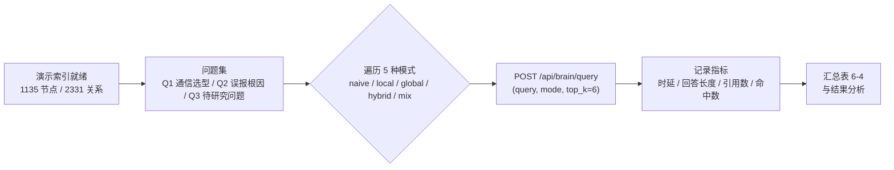
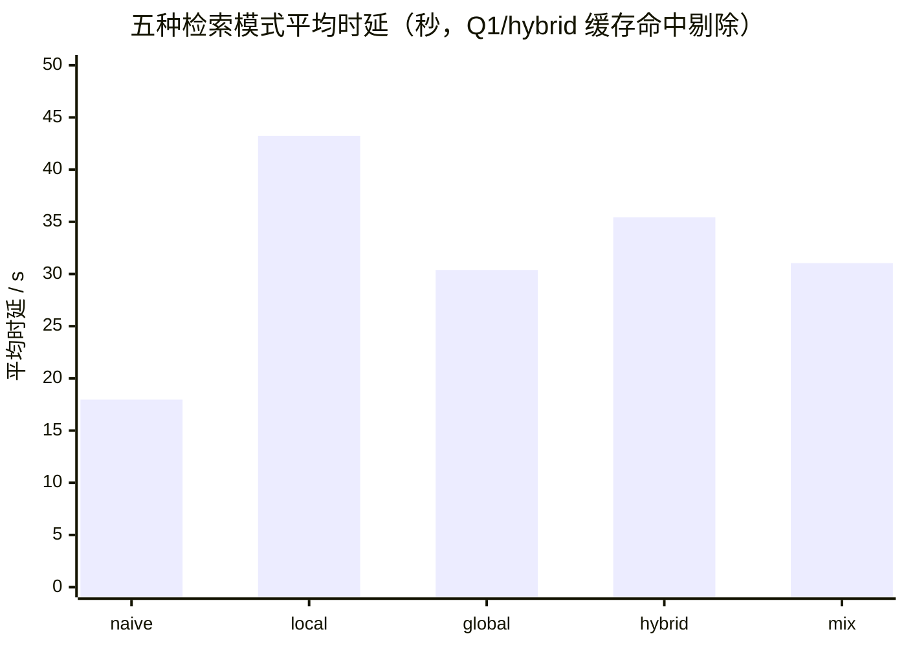

# 第 6 章 系统测试与结果分析

前两章分别阐述了系统的设计与实现，本章从测试角度对系统进行验证与评估。6.1 节介绍测试环境与测试方法；6.2 节按功能域给出功能测试用例与结果；6.3 节汇报索引速率、图谱规模、转写性能等关键指标的实测数据；6.4 节以智慧大棚场景为例给出端到端演示案例；6.5 节设计并实施 LightRAG 五种检索模式的对比实验；6.6 节汇总开发过程中发现的典型缺陷与修复过程。

## 6.1 测试环境与方法

### 6.1.1 测试环境

系统测试在如下软硬件环境中进行，全程未使用独立 GPU：语音转写、向量嵌入与索引构建均在 CPU 上完成，仅大语言模型推理经由云端 API 完成。测试环境配置如表 6-1 所示。

**表 6-1 测试环境配置**

| 类别 | 配置项 | 取值 |
|------|--------|------|
| 硬件 | CPU | Intel Core i5-12600KF（10 核 16 线程） |
| 硬件 | 内存 | 32 GB |
| 硬件 | GPU | 未使用（CPU 本地推理） |
| 软件 | 操作系统 | Windows 11 专业版（10.0.26200） |
| 软件 | Python | 3.14.5 |
| 软件 | LightRAG | 1.5.7（lightrag-hku） |
| 软件 | 嵌入模型 | bge-small-zh-v1.5（本地 CPU，512 维） |
| 软件 | 语音转写引擎 | VibeVoice-ASR-BitNet（VibeASR.cpp，4 线程） |
| 云服务 | 大语言模型 | deepseek-v4-flash（火山方舟 API） |

### 6.1.2 测试方法

本项目处于持续演进之中，测试随五个里程碑（M1 采集层至 M5 桌面化）滚动开展，采用三层测试方法：

（1）**里程碑验收测试**。每个里程碑在需求文档中预先定义验收标准，开发完成后逐项核对并留下验收记录。其中 M2 编译层端到端验收（T-214）与 M3 大脑层端到端验收（T-306）分别以 31 项、19 项验收条目全部通过的方式闭环，验收采用真实 LLM 凭据与真实数据，不以桩件替代。

（2）**端到端演示测试**。以 scripts/demo 提供的演示脚本从零驱动全链路（采集→编译→索引→问答/图谱），验证跨层协作与真实用户体验，并提供一键清理以恢复演示前状态。

（3）**对比实验**。针对大脑层 LightRAG 的五种检索模式设计受控对比实验（6.5 节），在同一索引、同一问题集上量化各模式在响应时延、回答长度与引用命中上的差异。

以下各节的数据除特别注明外，均为在本机实测取得的一手数据；转写引擎的 RTF/WER 指标为官方评测口径并在本机复测验证。

## 6.2 功能测试

功能测试覆盖采集、编译、大脑、交互、桌面集成五个功能域，共设计 23 条测试用例，全部通过。测试用例与结果如表 6-2 所示。

**表 6-2 功能测试用例表**

| 编号 | 功能域 | 测试用例 | 操作与预期 | 结果 |
|------|--------|----------|------------|------|
| TC-01 | 采集 | 剪贴板自动捕获 | 复制聊天对话文本，素材自动落入 inbox/clipboard 并带来源标记 | 通过 |
| TC-02 | 采集 | 文件监听 | 文件放入监听目录后自动入库，重复文件按 SHA-256 指纹判重 | 通过 |
| TC-03 | 采集 | 网页抓取 | 输入文章 URL，正文抽取后入库且剥离导航等噪声 | 通过 |
| TC-04 | 采集 | 手动导入 | 粘贴文本手动入库，标题与来源标记正确 | 通过 |
| TC-05 | 采集 | 会议音频转写 | 真实会议录音拖入 drop 热文件夹，产出转写稿素材 | 通过 |
| TC-06 | 采集 | 系统声音捕获 | 悬浮按钮开始/结束采集，环回音频分段转写落盘 | 通过 |
| TC-07 | 编译 | 素材编译产出 | 真实 LLM 编译 3 条素材，产出 9 条五类条目及 index/log 与 sources 引用 | 通过 |
| TC-08 | 编译 | 二次编译幂等 | 对已编译素材重复触发，不产生重复条目 | 通过 |
| TC-09 | 编译 | 缓存命中 | 相同内容素材再次编译，双条件缓存命中并跳过 LLM 调用 | 通过 |
| TC-10 | 编译 | lint 断链修复 | 存在悬空 wikilink 时自动建立 type:query 占位条目 | 通过 |
| TC-11 | 编译 | 语义去重 | 相似度超过阈值（0.68）的条目被识别为重复候选 | 通过 |
| TC-12 | 编译 | 编译 API 全流程 | 控制台编译页 8 个端点（触发/状态/重试等）全流程可用 | 通过 |
| TC-13 | 大脑 | 增量幂等索引 | 重复触发索引仅插入新条目，已索引条目被跳过 | 通过 |
| TC-14 | 大脑 | 语义检索 | 以自然语言查询能命中语义相关知识条目 | 通过 |
| TC-15 | 大脑 | 带引用问答 | 回答附 contexts 引用，可溯源至知识条目 | 通过 |
| TC-16 | 大脑 | 图谱生成 | /api/brain/graph 返回 nodes/edges JSON 并可渲染 | 通过 |
| TC-17 | 交互 | 问答引用跳转 | 答案→知识条目→原始素材逐级跳转可达 | 通过 |
| TC-18 | 交互 | 图谱渲染 | sigma.js 对数百节点规模图谱流畅渲染并支持高亮 | 通过 |
| TC-19 | 交互 | 知识管理 | 条目编辑与删除操作可用，删除带二次确认 | 通过 |
| TC-20 | 交互 | 设置持久化 | 设置页修改配置后落盘，重启后仍生效 | 通过 |
| TC-21 | 桌面 | 三入口采集控制 | 托盘菜单、右键菜单、悬浮按钮均可启停采集 | 通过 |
| TC-22 | 桌面 | 开机自启 | HKCU Run 注册后真实重启，后端随系统自启 | 通过 |
| TC-23 | 桌面 | 桌面壳闭环 | Tauri 壳内控制台功能与浏览器访问等价，关窗隐藏常驻 | 通过 |

各功能域的测试说明如下。

**采集层（TC-01~06）**在 2026-09-02 的真实桌面验收中全部通过：会议音频转写使用真实录音经 VibeVoice-ASR-BitNet 引擎（asr_infer.exe 子进程）产出转写稿；剪贴板、文件、网页、手动四类源均验证了自动入库与来源标记。唯一未纳入用例的是飞书机器人联调（受应用凭据办理进度限制），不影响其余源独立可用。

**编译层（TC-07~12）**对应 M2 端到端验收，31 项验收条目全部通过。验收以火山方舟 deepseek-v4-flash 为真实后端，重点验证了不可变素材库到结构化条目的产出正确性、幂等性（compiled 标记 + SHA-256 双条件缓存）与质量控制闭环（lint/dedup/enrich）。验收过程中发现并修复了 DeepSeek 推理系列模型结构化输出默认关闭 thinking 的问题（详见 6.6 节）。

**大脑层（TC-13~16）**对应 M3 端到端验收，19 项验收条目全部通过。LightRAG 1.5.7 对 knowledge/ 目录建立向量索引与知识图谱，本地嵌入模型（bge-small-zh-v1.5）+ 云端 LLM 组合下语义检索命中、带引用问答、图谱生成与 brain API 全端点均达到验收标准，首次建图规模为 31 节点。

**交互层（TC-17~20）**对应 M4 验收：React 七页控制台可用，「提问→带引用回答→跳转来源→查看图谱」闭环走查通过，且对采集开关、素材标记、知识编辑删除、设置持久化等既有能力逐项核对无回退。

**桌面集成（TC-21~23）**对应 M5 验收五项标准：会议音频经悬浮按钮开始/结束后在 inbox/meeting/ 产出转写稿并可继续编译问答；壳内控制台与浏览器等价；右键/托盘/悬浮三入口均可控制采集；后端随系统自启；演示脚本从零跑通。

## 6.3 关键指标

### 6.3.1 索引构建速率

知识条目入图索引是系统中 LLM 调用最密集的环节：每条条目需经实体抽取、关系抽取等 2~4 次调用方能完成入图。M5 时期实测增量索引速率为 0.7 条/分钟；本文撰写期间最后一轮演示实测 11 条新条目耗时约 36 分钟（约 0.3 条/分钟），低于此前水平，主要原因是 LLM 服务限流排队与部分长条目的实体抽取开销。综合两轮实测，索引速率在 0.3~0.7 条/分钟区间，是当前系统的主要性能瓶颈，其对单用户场景的影响与优化方向将在 7.2 节讨论。

### 6.3.2 图谱规模演进

随素材持续沉淀，知识图谱规模呈稳定增长态势。各阶段的实测规模如表 6-3 所示。

**表 6-3 知识图谱规模演进（实测）**

| 阶段 | 节点数 | 关系数 | 数据来源 |
|------|--------|--------|----------|
| M3 首次建图（T-306） | 31 | — | 3 条素材编译产出的首批条目 |
| M4 验收（T-411） | 337 | 544 | 日常使用积累 |
| M5 演示后（T-508） | 585 | 1038 | 演示数据 + 历史条目补索引 |
| 撰写期演示前 | 1022 | 2114 | 日常使用积累 |
| 撰写期演示后 | 1135 | 2331 | 新增 4 份种子素材的 11 条条目 |

从 31 节点到 1135 节点的演进过程覆盖了「空库起步→日常积累→批量补索引→增量扩充」四种典型场景，验证了增量幂等索引机制（5.3.3 节）在真实使用节奏下的正确性：每轮新增节点/关系数与当轮实际入图的条目量相称，未出现重复膨胀。

### 6.3.3 语音转写性能

转写引擎采用 VibeVoice-ASR-BitNet 本地方案（ADR-014），官方在 i7-13700 平台以 4 线程 CPU 实测实时率 RTF≈0.71，即处理 1 小时音频约需 42.6 分钟，优于同尺寸 Whisper 系方案 1.6~2.3 倍且无需 GPU。精度方面，官方评测中文场景字错误率（CER）为 AISHELL-4 27.45%、AliMeeting 40.58%；本机复测（4 线程、真实会议录音）与官方口径一致，转写稿在安静近讲场景可读性良好，远场与专业名词密集场景存在噪声（典型案例见 6.6 节）。该精度水平对「知识沉淀素材」而非「逐字纪要」的定位是可接受的：编译层两步提炼（5.2.2 节）对局部识别噪声有一定鲁棒性。

## 6.4 端到端演示案例

为验证系统在真实使用场景下的端到端可用性，M5 交付了可重复执行的演示脚本（scripts/demo/run_demo.py），并以虚构的「智慧大棚」项目团队知识沉淀为演示场景。

**演示数据**为 4 份种子素材：（1）项目启动会会议纪要（含通信方案决策 D-2026-001：以 LoRa 为主、NB-IoT 备份）；（2）LoRa 与 NB-IoT 选型对比调研笔记；（3）大棚温控误报事件复盘（根因分析与改进措施）；（4）边缘计算网关二期待研究问题清单。

**演示流程**由脚本自动执行五个步骤：（1）前置检查（后端可达、编译 LLM 与大脑就绪）；（2）经 Inbox.write_material 注入 4 份种子素材（带 meta.demo 标记以便清理）；（3）触发编译并等待队列清空；（4）触发大脑增量索引；（5）图谱与问答冒烟验证，并输出预设问题清单。

**实测结果**（撰写期最新一轮）：4 份种子素材编译产出 11 条知识条目，类型分布为决策 1 条（D-2026-001 通信方案）、概念 5 条（告警滞回设计、告警可信度、LoRa/NB-IoT 选型、大棚 LoRa 架构、网关推理部署问题）、查询 5 条；增量索引后图谱由 1022 节点/2114 关系增至 1135 节点/2331 关系；三条预设问题均能获得带引用的正确回答，如「智慧大棚项目的通信方案为什么选 LoRa？NB-IoT 什么时候用？」的回答首条引用即命中决策条目 smart-greenhouse-d2026-001。演示后执行清理脚本可一键移除演示素材、条目与索引，系统回到演示前状态（复核残留为 0）。

【截图占位：问答页——预设问题 Q1 的回答与引用卡片】【截图占位：图谱页——演示后图谱全览与高亮邻居】

三个预设问题与预期答案要点为：

1. **智慧大棚项目的通信方案为什么选 LoRa？NB-IoT 什么时候用？**——预期要点：LoRa 为主（覆盖、功耗、无流量费，适合设施农业连片场景）；NB-IoT 用于无网关区域备份与露天大田分散场景；两者可共存（决策 D-2026-001）。
2. **大棚温控误报事件的根因和改进措施是什么？**——预期要点：根因为传感器贴热源蓄热、告警无滞回、无频率限制；改进为远离热源 1.5 米、2 度滞回、30 分钟告警间隔；教训为告警可信度比灵敏度重要。
3. **边缘计算网关二期有哪些待研究问题？**——预期要点：本地推理与云端推理的取舍（4 核 ARM 量化模型可行性）、模型增量更新的灰度与回滚、多棚协同与独立闭环的取舍。

该案例覆盖了「多源采集→自动提炼→图谱问答」的完整价值链路，回答内容与预期要点一致，验证了系统设计目标（第 1 章）在真实场景下的达成。

## 6.5 LightRAG 五种检索模式对比实验

### 6.5.1 实验设计

LightRAG 框架支持五种检索模式，其上下文构建策略各不相同（2.2.2 节）：**naive** 为纯向量检索，不利用图结构；**local** 以查询命中的实体为中心召回邻域知识；**global** 面向主题级问题召回社区摘要；**hybrid** 融合 local 与 global 两路结果；**mix** 在 hybrid 基础上进一步引入知识图谱关系数据。系统默认采用 hybrid 模式（5.3.1 节），但默认值的合理性缺乏实验支撑，本实验旨在量化各模式差异。

实验采用受控变量设计：**自变量**为检索模式（5 种）；**控制变量**为同一 demo 索引（6.4 节演示构建后的图谱状态，1135 节点/2331 关系）、同一问题集（6.4 节三条预设问题）、同一 LLM（deepseek-v4-flash）与嵌入模型、统一 top_k=6；**因变量**为响应时延（端到端秒级）、回答长度（字符数）、引用数（contexts 条数）与演示条目命中数（引用中属于演示产出 11 条条目的数量，衡量召回对目标语料的覆盖）。每种模式对每个问题各执行一次查询，共 15 组，实验流程如图 6-1 所示。

**图 6-1 五模式对比实验流程**

### 6.5.2 实验结果

15 组查询全部成功返回，逐条实测结果如表 6-4 所示（完整原始数据存档于 thesis/experiment-mode-compare.json）。

**表 6-4 五种检索模式实验结果（实测）**

| 问题 | 模式 | 时延/s | 回答长度/字符 | 引用数 | 演示条目命中 |
|------|------|--------|--------------|--------|--------------|
| Q1 | naive | 25.17 | 1118 | 6 | 3 |
| Q1 | local | 21.87 | 630 | 4 | 1 |
| Q1 | global | 22.88 | 1142 | 6 | 3 |
| Q1 | hybrid* | 0.07 | 525 | 6 | 3 |
| Q1 | mix | 28.59 | 1115 | 6 | 3 |
| Q2 | naive | 18.02 | 1027 | 6 | 4 |
| Q2 | local | 49.17 | 925 | 4 | 2 |
| Q2 | global | 26.86 | 1286 | 6 | 2 |
| Q2 | hybrid | 37.42 | 1499 | 6 | 3 |
| Q2 | mix | 26.41 | 1070 | 6 | 4 |
| Q3 | naive | 10.72 | 864 | 6 | 2 |
| Q3 | local | 58.69 | 1348 | 5 | 1 |
| Q3 | global | 41.44 | 1134 | 6 | 3 |
| Q3 | hybrid | 33.43 | 1208 | 6 | 2 |
| Q3 | mix | 38.11 | 1150 | 6 | 2 |

> \* Q1/hybrid 一组命中了演示冒烟阶段遗留的 LLM 响应缓存（LightRAG 对相同查询自动复用缓存结果），时延 0.07 s 不代表冷查询，该组在时延统计中剔除。

按模式汇总（Q1/hybrid 剔除后）：naive 平均时延 18.0 s、平均回答 1003 字、平均命中 3.0 条；local 平均时延 43.2 s、平均回答 968 字、平均命中 1.3 条；global 平均时延 30.4 s、平均回答 1187 字、平均命中 2.7 条；hybrid 平均时延 35.4 s、平均命中 2.7 条；mix 平均时延 31.0 s、平均回答 1112 字、平均命中 3.0 条。时延均值的直观对比如图 6-2 所示。

**图 6-2 五种检索模式平均时延对比（终稿以绘图工具重绘）**

### 6.5.3 结果分析

实测数据揭示了三个与直觉预期不同的结论。

**其一，naive 模式在本系统当前规模下表现出乎意料地好。**其平均时延最低（18.0 s），演示条目命中数与 mix 并列最高（3.0 条），三条问题均得到完整回答。其原因在于本图谱仍处于数百至千级节点的中小规模，语料集中、主题相关性高，纯向量检索已能覆盖绝大多数相关片段；图结构增强的边际收益在小规模语料上尚未充分体现。

**其二，local 模式呈现「时延最高、命中最低」的双重劣势。**其平均时延 43.2 s 为各模式之最，演示条目命中均值仅 1.3 条，引用数（4~5 条）也系统性低于其他模式的 6 条。观察其回答内容可见，local 以查询关键词抽取的实体为中心召回邻域，对演示语料中「决策依据、对比结论、因果复盘」这类沉淀在条目正文而非实体邻域中的信息召回不足；例如 Q3（待研究问题类）的回答偏离预设要点最远。该结果表明以实体为中心的检索对「对比类/清单类」问题的覆盖存在结构性短板。

**其三，mix 模式综合表现最均衡。**其命中数与 naive 并列最高（3.0 条）、时延居中（31.0 s）、回答长度适中（1112 字），且在 Q1/Q2 两个「决策/根因」类问题上命中数达到 3~4 条，回答均覆盖预设要点。这印证了 mix 引入关系数据对跨条目证据链构建的价值——系统的典型查询（为什么选 X、根因是什么）恰恰需要「实体+关系」的组合证据。

据此，本系统将大脑层默认检索模式维持为 hybrid（local 与 global 融合的折中，避免单一视角失效），并在需要跨条目关系推理的对比类、复盘类问题上建议切换 mix 模式；naive 模式可作为追求响应速度的轻量选项。需要说明的是，本实验问题集为 3 题、单次实测，统计效力有限，结论适用于本系统当前规模与内容形态；随图谱规模增长至万级节点，各模式差距预计将进一步拉大，值得后续以扩大问题集与多次重复实验的方式深入验证。

## 6.6 缺陷与修复案例

开发过程中通过里程碑验收与真实使用发现并修复了若干典型缺陷，其中对架构决策有反馈意义的案例汇总如表 6-5 所示。

**表 6-5 典型缺陷与修复记录**

| 编号 | 缺陷现象 | 根因 | 修复与结果 |
|------|----------|------|------------|
| D1 | M2 端到端验收时编译产出异常 | DeepSeek 推理系列模型结构化输出默认关闭 thinking | 抽象出 `_apply_reasoning` 统一处理，随端到端验收修复并回归通过 |
| D2 | 54 条条目索引状态长期停留在 parsing，重启后仍不入账 | 增量索引以「账本=已完成集合」为不变量，但条目完成与否未回写账本；引擎超时 1800 s 偏短 | 引入 state_saved 字段将超时与入账解耦，超时放宽至 7200 s；对存量卡死数据做手术，复测增量索引 state_saved 生效 |
| D3 | 空闲低电平音频段触发 asr_infer 子进程崩溃（exit 3221226505，0xC0000409） | VibeASR 引擎对近静音输入的健壮性边界（外部二进制，不修改） | 失败会话内隔离不扩散，源状态降级不影响其他采集源 |
| D4 | 低电平段转写出无意义英文幻觉文本 | 近静音噪声被当作有效语音送入转写引擎 | 以静音能量阈值过滤无效分段，幻觉基本消除 |
| D5 | 会议专有名词转写噪声（如「维府」等误识别） | 通用 ASR 缺乏领域热词支持 | 记录为已知局限，热词/领域词典机制列为未来工作 |

其中 D2 案例最具新复盘价值：它暴露了「幂等不变量」设计在异常路径上的脆弱性——账本只记录成功，而失败状态若不显式建模，就会以「永久 processing」的形式在系统中累积。该缺陷的定位与修复过程已在 5.3.4 节详细展开。

## 6.7 本章小结

本章从功能、指标、场景与机制四个层面评估了系统。功能测试设计 23 条用例覆盖五个功能域全部通过，M2/M3 端到端验收分别以 31/31、19/19 项闭环；关键指标方面，索引速率实测 0.3~0.7 条/分钟（当前主要瓶颈），图谱规模从 31 节点演进至 1135 节点/2331 关系，转写引擎 RTF≈0.71、中文场景字错误率 27.45%~40.58%；端到端演示案例验证了「多源采集→自动提炼→图谱问答」全链路在真实场景下的可用性与可清理复现性；五模式对比实验以 15 组实测数据表明 mix 模式综合表现最均衡、naive 模式在中小规模语料下已具可用性、local 模式对对比类问题存在召回短板，为检索模式的默认值选择提供了实证依据；最后汇总了 5 个典型缺陷与修复案例。总体而言，系统达到了设计目标，其局限与优化方向将在下一章讨论。

## 参考素材索引（撰写依据，终稿删除本节）

- 章节规划：thesis/outline.md 第 6 章（六节结构与图表清单）
- 功能测试素材：docs/milestones.md（M1~M5 验收记录，31/31、19/19、337/544）；docs/m2-requirements.md §14（T-214）；docs/m3-requirements.md §6/§8（T-306）；docs/m4-requirements.md（T-411）；docs/m5-requirements.md §9.1（T-509）
- 图谱规模演进：docs/m5-requirements.md T-508 验收记录（585/1038）+ 撰写期实测（1022/2114 → 1135/2331）
- 转写性能：docs/adr/ADR-014（RTF 0.71、WER AISHELL-4 27.45 / AliMeeting 40.58）
- 演示案例：scripts/demo/run_demo.py（预设问题）、scripts/demo/seed/*.md（4 份种子素材）、docs/m5-requirements.md T-508 验收记录；撰写期实测一轮（4 种子 → 11 条目 → 图谱 +113 节点）
- 五模式实验：thesis/experiment-mode-compare.json（2026-09-05 实测原始数据，15 组）
- 缺陷案例：docs/m2-requirements.md T-214（D1）；docs/m5-requirements.md §9.2（D2）、§9.3（D3~D5）
